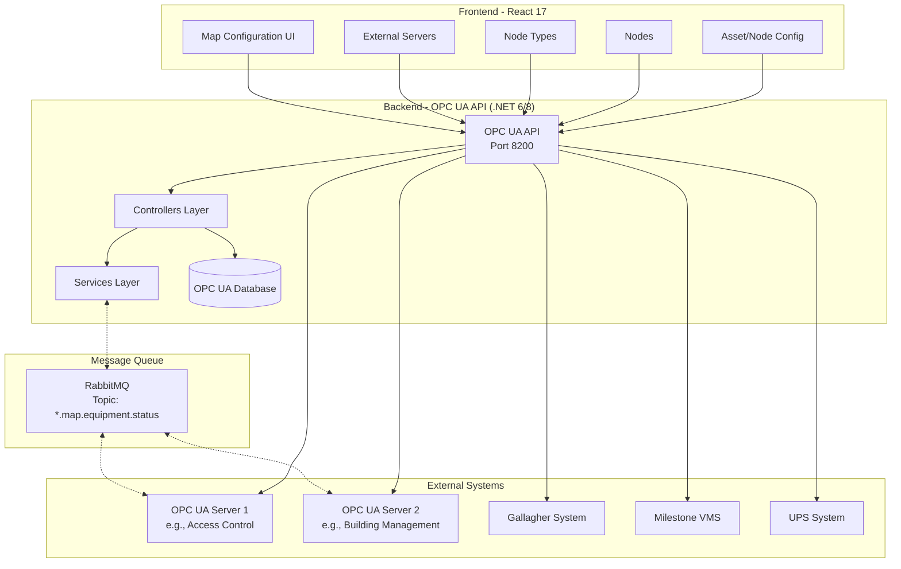
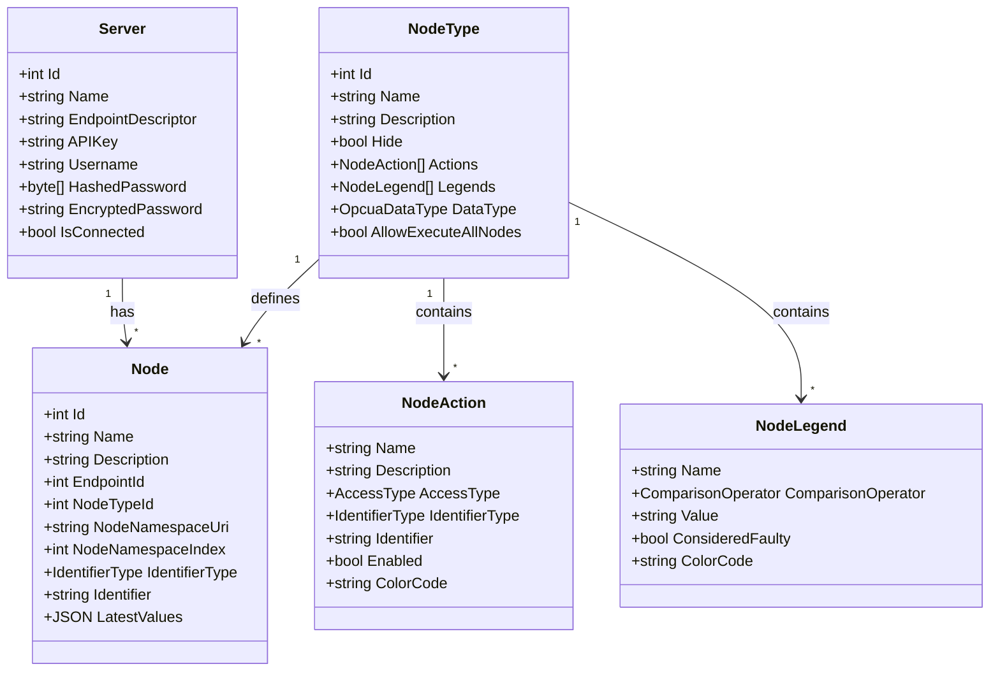
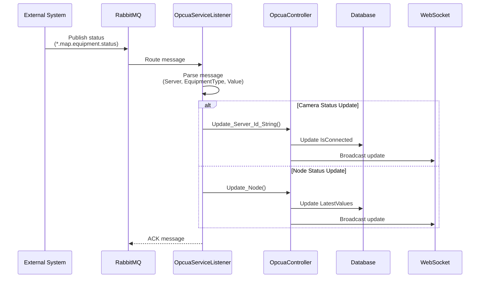
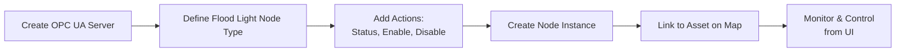
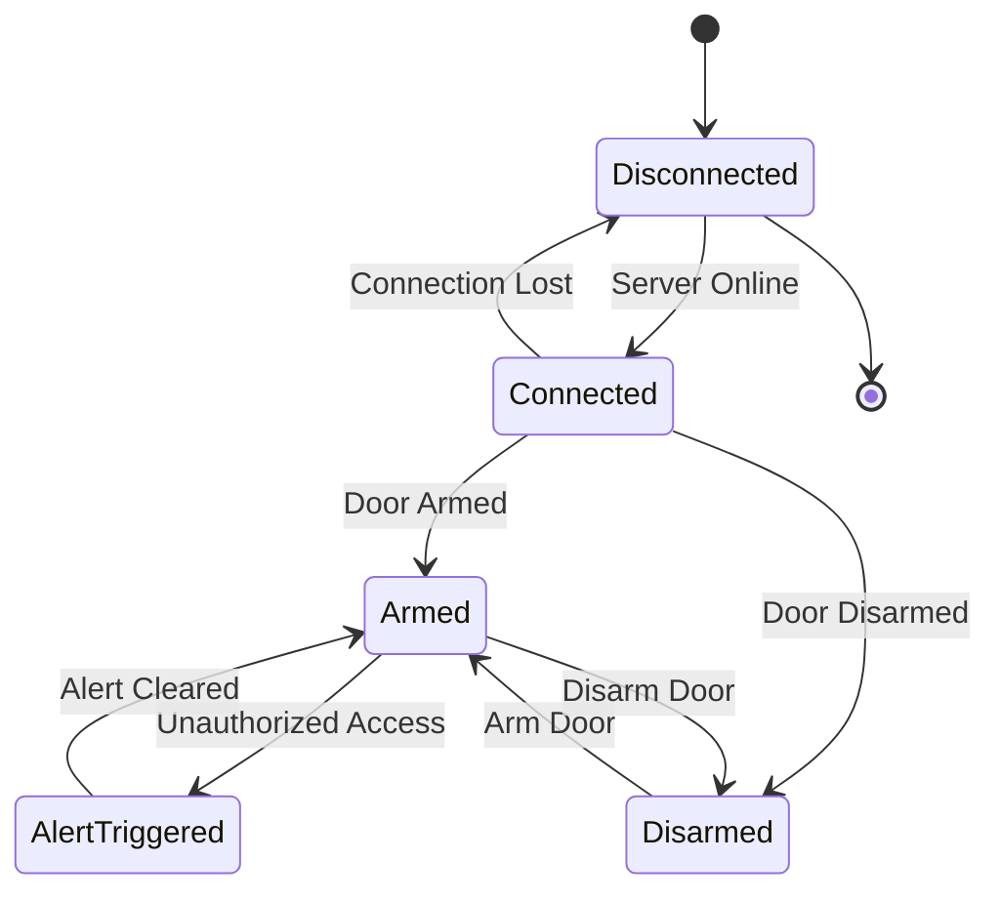

# Building Controls Documentation - OPC UA Module

## Overview

The **OPC UA Module** is a microservice within the SCCS (Security Command & Control System) backend that enables integration with building automation and industrial control systems using the OPC UA (Open Platform Communications Unified Architecture) protocol. This module allows the security system to monitor and control various building equipment such as access control panels, sensors, lighting, HVAC systems, and other IoT devices.

## Architecture

### System Architecture



### Component Structure



## Data Model

### Core Tables

#### 1. Servers Table
Stores OPC UA server connection information.

| Column | Type | Description |
|--------|------|-------------|
| Id | int | Primary key |
| Name | string(255) | Server name |
| Description | string(4000) | Server description |
| EndpointDescriptor | string | OPC UA endpoint URL<br/>e.g., `opc.tcp://192.168.1.100:4840/OPCUA/Server` |
| APIKey | string | Authentication API key |
| Username | string | Optional username |
| HashedPassword | byte[] | Hashed password for security |
| EncryptedPassword | string | Encrypted password (to be improved) |
| IsConnected | bool | Current connection status |

#### 2. NodeTypes Table
Defines reusable templates for OPC UA nodes with predefined actions.

| Column | Type | Description |
|--------|------|-------------|
| Id | int | Primary key |
| Name | string(255) | Node type name (e.g., "Flood Light", "Door Lock") |
| Description | string(4000) | Detailed description |
| Hide | bool | Hide from UI display |
| AllowExecuteAllNodes | bool | Allow bulk execute on all nodes |
| ExecuteAllNodesText | string(20) | Button text for bulk execute |
| Actions | NodeAction[] | JSON array of available actions |
| Legends | NodeLegend[] | JSON array of status legends |
| DataType | OpcuaDataType | Expected data type (STRING, INTEGER, BOOLEAN, etc.) |

**NodeAction Structure:**
```json
{
    "Name": "Turn On",
    "Description": "Turn on the flood light",
    "AccessType": 1,
    "IdentifierType": "s",
    "Identifier": "Enable.Floodlight",
    "Enabled": true,
    "ColorCode": "#00FF00"
}
```

**NodeLegend Structure:**
```json
{
    "Name": "Normal",
    "ComparisonOperator": "Equal_To",
    "Value": "On",
    "ConsideredFaulty": false,
    "ColorCode": "#00FF00"
}
```

#### 3. Nodes Table
Individual OPC UA node instances mapped to specific equipment.

| Column | Type | Description |
|--------|------|-------------|
| Id | int | Primary key |
| Name | string(255) | Node name |
| Description | string(4000) | Node description |
| EndpointId | int | FK to Servers table |
| NodeTypeId | int | FK to NodeTypes table |
| NodeNamespaceUri | string(255) | OPC UA namespace URI |
| NodeNamespaceIndex | int | OPC UA namespace index |
| IdentifierType | IdentifierType | Identifier type (i, s, g, b) |
| Identifier | string | Node identifier value |
| LatestValues | JSON | Latest read values from node |

**OPC UA Node Format:**
```
ns=<namespaceIndex>;<identifierType>=<identifier>
Example: ns=2;s=Device.FloodLight.Status
```

### Enumerations

#### AccessType
| Key | Value | Description |
|-----|-------|-------------|
| READ | 0 | Read-only access |
| EXECUTE | 1 | Execute/write access |

#### IdentifierType
| Key | Value | Description |
|-----|-------|-------------|
| INTEGER | i | Integer identifier |
| STRING | s | String identifier |
| GUID | g | GUID identifier |
| OPAQUE | b | Opaque/binary identifier |

#### OpcuaDataType
- STRING
- INTEGER
- BOOLEAN
- DOUBLE
- FLOAT
- DATETIME
- (and more...)

#### ComparisonOperator
- Equal_To
- Not_Equal_To
- Greater_Than
- Less_Than
- Greater_Than_Or_Equal_To
- Less_Than_Or_Equal_To
- Contains
- Not_Contains

## API Endpoints

### Controllers

#### 1. OpcuaController
Handles read/write operations and incoming updates.

```http
# Incoming server updates
POST /incoming/server/{id}
POST /incoming/server/{id}/{value}
POST /incoming/server/endpointdescriptor/{endpointdescriptor}
POST /incoming/server/endpointdescriptor/{endpointdescriptor}/{value}
```

#### 2. DataController
Provides data access for servers, nodes, and node types.

```http
# Enumerations
GET /accesstypes
GET /identifiertypes
GET /opcuadatatypes
GET /comparisonoperators

# Servers
GET /servers
GET /servers/{id}
GET /servers/{id}/nodes
GET /servers/endpointdescriptor/{endpointdescriptor}/nodes

# Node Types
GET /nodetypes
GET /nodetypes/{id}

# Nodes
GET /nodes
GET /nodes/{id}
```

#### 3. ManagementController
CRUD operations for configuration management.

```http
# Server Management
POST /servers
PUT /servers/{id}
DELETE /servers/{id}
POST /servers/query

# Node Type Management
POST /nodetypes
PUT /nodetypes/{id}
DELETE /nodetypes/{id}
POST /nodetypes/query

# Node Management
POST /nodes
PUT /nodes/{id}
DELETE /nodes/{id}
POST /nodes/query
```

#### 4. SchemaController
Provides schema definitions for dynamic form generation.

```http
GET /schema/server
GET /schema/nodetype
GET /schema/node
```

## Frontend Integration

### UI Pages

All OPC UA management pages are located under: **Map → Map Configuration**

#### 1. External Servers Page
- **Route:** `/app/map/masterdata/servers`
- **Files:** 
  - [src/core-frontend/MozartCoreFrontend/ClientApp/src/pages/map/servers/list.js](../src/core-frontend/MozartCoreFrontend/ClientApp/src/pages/map/servers/list.js)
  - [src/core-frontend/MozartCoreFrontend/ClientApp/src/pages/map/servers/form.js](../src/core-frontend/MozartCoreFrontend/ClientApp/src/pages/map/servers/form.js)
- **Permission:** `opcua.manage-servers`
- **Purpose:** Configure OPC UA server connections

#### 2. Node Types Page
- **Route:** `/app/map/masterdata/nodetypes`
- **Files:**
  - [src/core-frontend/MozartCoreFrontend/ClientApp/src/pages/map/nodetypes/list.js](../src/core-frontend/MozartCoreFrontend/ClientApp/src/pages/map/nodetypes/list.js)
  - [src/core-frontend/MozartCoreFrontend/ClientApp/src/pages/map/nodetypes/form.js](../src/core-frontend/MozartCoreFrontend/ClientApp/src/pages/map/nodetypes/form.js)
- **Permission:** `opcua.manage-nodetypes`
- **Purpose:** Define reusable node type templates with actions

#### 3. Nodes Page
- **Route:** `/app/map/masterdata/nodes`
- **Files:**
  - [src/core-frontend/MozartCoreFrontend/ClientApp/src/pages/map/nodes/list.js](../src/core-frontend/MozartCoreFrontend/ClientApp/src/pages/map/nodes/list.js)
  - [src/core-frontend/MozartCoreFrontend/ClientApp/src/pages/map/nodes/form.js](../src/core-frontend/MozartCoreFrontend/ClientApp/src/pages/map/nodes/form.js)
- **Permission:** `opcua.manage-nodes`
- **Purpose:** Configure individual OPC UA node instances

#### 4. Asset/Node Config Page
- **Route:** `/app/map/masterdata/assets`
- **Files:**
  - [src/core-frontend/MozartCoreFrontend/ClientApp/src/pages/map/assets/list.js](../src/core-frontend/MozartCoreFrontend/ClientApp/src/pages/map/assets/list.js)
  - [src/core-frontend/MozartCoreFrontend/ClientApp/src/pages/map/assets/form.js](../src/core-frontend/MozartCoreFrontend/ClientApp/src/pages/map/assets/form.js)
- **Permission:** `map.manage-opcuaassets`
- **Purpose:** Link physical security assets to OPC UA nodes for map visualization

### Service Discovery

The frontend uses the Discovery service to locate the OPC UA API endpoint:

```javascript
// Endpoint configuration
const disco = await Discovery.get();
const apiUrl = disco['mozart-opcua-api_endpoint'];
// Default: http://localhost:8200
```

## Message Queue Integration

### OpcuaServiceListener

The service listens to RabbitMQ messages for equipment status updates.



### Message Format

```json
{
    "Server": "opc.tcp://192.168.1.100:4840/OPCUA",
    "EquipmentType": "Camera",
    "IdentifierType": "s",
    "EquipmentName": "Front Door Camera",
    "EquipmentTag": "Camera_001",
    "Value": "connected"
}
```

## Use Cases & Workflows

### Use Case 1: Configure Flood Light Control



**Step-by-Step:**

1. **Add Server**
   - Navigate to: Map → Map Configuration → External Servers
   - Configure endpoint: `opc.tcp://building.local:4840/OPCUA`
   - Set credentials (username, password, API key)

2. **Create Node Type**
   - Navigate to: Map → Map Configuration → Node Types
   - Name: "Flood Light"
   - Define Actions:
     - **Status** (READ): `ns=2;s=Floodlight.Status`
     - **Turn On** (EXECUTE): `ns=2;s=Floodlight.Enable`
     - **Turn Off** (EXECUTE): `ns=2;s=Floodlight.Disable`

3. **Create Node**
   - Navigate to: Map → Map Configuration → Nodes
   - Name: "Main Entrance Flood Light"
   - Select Server and Node Type
   - Set Identifier: `FloodLight_001`

4. **Link to Asset**
   - Navigate to: Map → Map Configuration → Asset/Node Config
   - Select Asset from Core Assets
   - Link to created Node
   - Set map coordinates (X, Y)

5. **Monitor & Control**
   - View asset status on indoor/outdoor maps
   - Execute actions through map UI
   - Receive real-time status updates via WebSocket

### Use Case 2: Access Control Integration



Integration with systems like Gallagher for door lock control:

1. Configure Gallagher server endpoint
2. Create "Door Lock" node type with actions:
   - Read Status
   - Lock
   - Unlock
   - Arm
   - Disarm
3. Map each door to a node
4. Monitor door status and receive alerts
5. Control doors remotely through UI

## Configuration Examples

### Example 1: Flood Light Configuration

**Server:**
```json
{
    "Id": 1,
    "Name": "Building_Main_OPC",
    "EndpointDescriptor": "opc.tcp://192.168.10.50:4840/OPCUA/Server",
    "IsConnected": true
}
```

**NodeType:**
```json
{
    "Id": 1,
    "Name": "Flood Light",
    "Description": "Outdoor flood light control",
    "DataType": "STRING",
    "Actions": [
        {
            "Name": "Status",
            "AccessType": 0,
            "IdentifierType": "s",
            "Identifier": "Status.Floodlight",
            "Enabled": true
        },
        {
            "Name": "Turn On",
            "AccessType": 1,
            "IdentifierType": "s",
            "Identifier": "Enable.Floodlight",
            "Enabled": true,
            "ColorCode": "#00FF00"
        },
        {
            "Name": "Turn Off",
            "AccessType": 1,
            "IdentifierType": "s",
            "Identifier": "Disable.Floodlight",
            "Enabled": true,
            "ColorCode": "#FF0000"
        }
    ],
    "Legends": [
        {
            "Name": "Online",
            "ComparisonOperator": "Equal_To",
            "Value": "On",
            "ConsideredFaulty": false,
            "ColorCode": "#00FF00"
        },
        {
            "Name": "Offline",
            "ComparisonOperator": "Equal_To",
            "Value": "Off",
            "ConsideredFaulty": true,
            "ColorCode": "#FF0000"
        }
    ]
}
```

**Node:**
```json
{
    "Id": 1,
    "Name": "Main_Entrance_Floodlight",
    "EndpointId": 1,
    "NodeTypeId": 1,
    "NodeNamespaceIndex": 2,
    "IdentifierType": "s",
    "Identifier": "Device.Floodlight.Main.001",
    "LatestValues": {
        "Status": "On",
        "LastUpdated": "2026-01-07T10:30:00Z"
    }
}
```

## Deployment

### Local Development

```bash
# Navigate to OPC UA directory
cd src/opcua/build

# Build the solution
./build.cmd

# Run the API
cd ../src/OpcuaApi
dotnet run
```

**Default endpoint:** `http://localhost:8200`

### Docker Deployment

```bash
# Build Docker image
cd src/opcua
docker build -t mozart-opcua-api -f src/OpcuaApi/Dockerfile .

# Run container
docker run -d \
  -p 8200:80 \
  -e ConnectionStrings__DefaultConnection="..." \
  -e RabbitMq__Host="rabbitmq" \
  --name opcua-api \
  mozart-opcua-api
```

## Security Considerations

1. **Authentication:**
   - Bearer token authentication required
   - API Key authentication supported
   - Tenant-based access control

2. **Password Storage:**
   - Passwords are hashed using secure algorithms
   - Encrypted passwords for OPC UA server credentials
   - TODO: Implement proper certificate-based encryption

3. **Permissions:**
   - Granular permissions per operation
   - Permission examples:
     - `opcua.manage-servers`
     - `opcua.manage-nodetypes`
     - `opcua.manage-nodes`
     - `map.manage-opcuaassets`

4. **Network Security:**
   - OPC UA connections should use secure channels (opc.tcp with security)
   - API should be behind reverse proxy in production
   - Message queue should be on internal network

## Performance Considerations

1. **Caching:**
   - Server and node data cached with cache dependencies
   - Cache duration: 3600 seconds (1 hour)
   - Cache varies by tenant header

2. **Connection Pooling:**
   - Minimum thread pool: 100 threads
   - Maximum concurrent connections: 1000
   - Request body size limits configured

3. **Database Indexing:**
   - Indexes on frequently queried columns
   - Foreign key indexes for joins
   - Composite indexes for complex queries

## Troubleshooting

### Common Issues

**1. Connection to OPC UA Server Fails**
- Verify endpoint descriptor format
- Check network connectivity
- Verify credentials
- Ensure OPC UA server allows anonymous/authenticated access
- Check security policy compatibility

**2. Node Values Not Updating**
- Verify RabbitMQ connection
- Check message routing key format: `<tenant>.map.equipment.status`
- Ensure node identifier matches equipment tag
- Review OpcuaServiceListener logs

**3. Frontend Cannot Reach API**
- Check Discovery service configuration
- Verify `mozart-opcua-api_endpoint` is set correctly
- Ensure CORS is configured properly
- Check authentication tokens

### Logging

The module uses Serilog for structured logging. Check logs for:
- OPC UA connection attempts
- Message queue subscriptions
- Data read/write operations
- Authentication failures

```csharp
Serilog.Log.Information("Successfully updated Server status with ID {ServerId}", serverId);
Serilog.Log.Error(ex, "Failed to connect to OPC UA server {Endpoint}", endpoint);
```

## Future Improvements

### TODO Items from Code

1. **Decouple from CoreLib**
   - Module is currently tied to Mozart's CoreLib
   - Should be shifted to standalone module

2. **Complete OPC UA Logic**
   - Implement actual read/write data logic in OpcuaController.cs
   - Add support for complex data types
   - Implement subscription mechanism for real-time updates

3. **Enhanced Security**
   - Implement proper certificate-based encryption
   - Move from string-based encrypted passwords to certificate storage
   - Add support for OPC UA security modes and policies

4. **Additional Features**
   - Browse OPC UA server namespace
   - Auto-discover nodes
   - Historical data access
   - Alarm and event subscription
   - Support for structured data types

## References

### Internal Documentation
- [OPC UA Module README](../src/opcua/README.md)
- [Video Feature Documentation](video-feature-documentation.md)

### External Resources
- [OPC UA Specification](https://opcfoundation.org/developer-tools/specifications-unified-architecture)
- [OPC UA .NET SDK](https://github.com/OPCFoundation/UA-.NETStandard)

### Related Projects
- Core Frontend: React 17 web interface
- Legacy API: Main microservice APIs
- Video Module: Camera and video management
- Map Module: Indoor/outdoor map visualization

---

**Document Version:** 1.0  
**Last Updated:** January 7, 2026  
**Maintained By:** SCCS Backend Team
