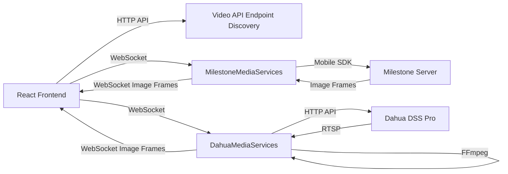
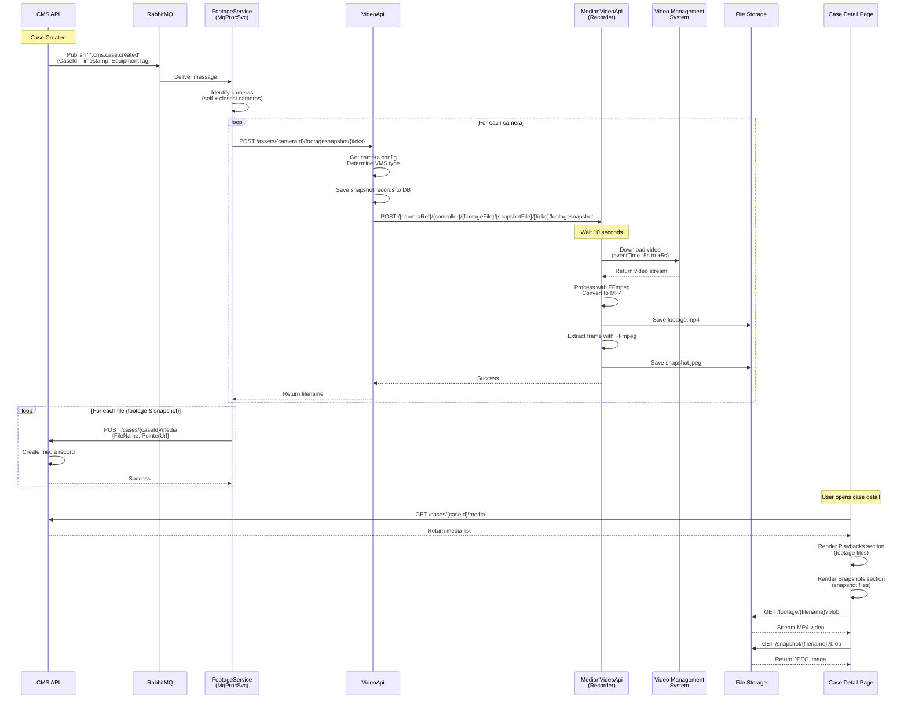
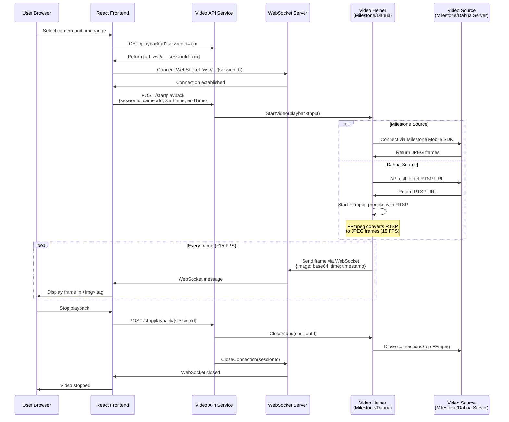
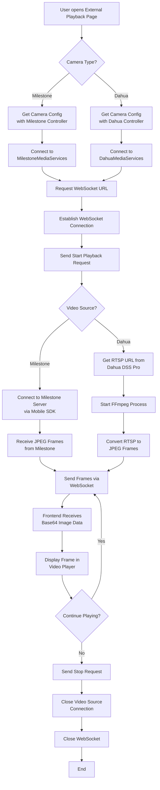
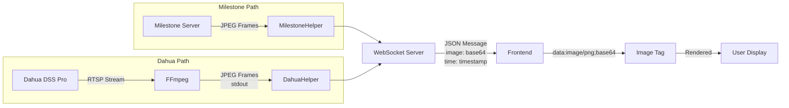

# Video Feature Documentation - SCCS Backend

## Table of Contents

1. [Overview](#overview)
   - [1. Live View](#1-live-view)
   - [2. Short Playback](#2-short-playback)
   - [3. External Playback](#3-external-playback)
2. [System Integration](#system-integration)
3. [System Architecture](#system-architecture)
4. [Feature 1: Live View](#feature-1-live-view)
5. [Feature 2: Short Playback (Automatic Case Footage)](#feature-2-short-playback-automatic-case-footage)
   - [Short Playback: Step-by-Step Processing Flow](#short-playback-step-by-step-processing-flow)
   - [Complete Flow Diagram](#complete-flow-diagram)
   - [Configuration](#configuration)
   - [Key Technical Details](#key-technical-details)
6. [Feature 3: External Playback (User-Initiated Historical Playback)](#feature-3-external-playback-user-initiated-historical-playback)
   - [External Playback: Step-by-Step Processing Flow](#external-playback-step-by-step-processing-flow)
   - [External Playback: Use Cases](#external-playback-use-cases)
   - [External Playback: Flow Diagrams](#external-playback-flow-diagrams)
   - [External Playback & Live View: Key Technical Details](#external-playback--live-view-key-technical-details)
7. [Feature Comparison Summary](#feature-comparison-summary)

---

## Overview

The SCCS (Security Command and Control System) backend provides three distinct video features for comprehensive security monitoring:

### 1. Live View
**Purpose**: Real-time monitoring of camera feeds
- Live streaming from cameras for active surveillance
- PTZ (Pan-Tilt-Zoom) camera controls for some cameras
- Multiple simultaneous camera views
- Used by security operators for real-time situation awareness

### 2. Short Playback
**Purpose**: Automatic incident documentation
- **10-second video clips** (5 seconds before + 5 after event) automatically generated when cases/alarms are created
- Provides immediate visual context for incidents without manual retrieval
- Captures from multiple cameras (equipment camera + closest cameras)
- Displayed in case detail page as "Playbacks" and "Snapshots"
- **Format**: Pre-recorded MP4 files and JPEG snapshots stored on server

### 3. External Playback
**Purpose**: User-initiated historical footage review
- On-demand video playback with timeline controls
- Date selection and time range navigation (24-hour timeline)
- Playback speed control (1x to 4x)
- Used for detailed incident investigation and evidence gathering
- **Format**: Real-time streaming via WebSocket (not pre-recorded files)

---

## System Integration

The system integrates with multiple Video Management Systems (VMS):
- **Milestone Mobile Service** - Returns video as image frames
- **Dahua DSS Pro** - Returns RTSP URLs that are converted to image frames
- **HikCentral, Hikvision, SenseTime, Qognify** - Various VMS integrations

**Technology Stack**:
- **WebSocket connections**: Used for Live View and External Playback (real-time streaming)
- **File-based delivery**: Used for Short Playback (pre-generated MP4/JPEG files)
- **FFmpeg**: Video processing for format conversion and frame extraction

---

## System Architecture

### Components
- **Frontend (React 17)**: Web application displaying video streams and case details
- **LegacyAPI Service**: API gateway (communication layer between frontend and video services) - *Currently not actively used for video, frontend directly connects to video services*
- **MqProcSvc (Message Queue Processing Service)**: Background service that listens for case creation events and triggers footage generation
- **VideoApi**: Main video API service for footage/snapshot generation and retrieval
- **MedianVideoApi**: Video recording service that handles actual video downloads from VMS
- **MilestoneMediaServices**: Microservice handling Milestone video playback
- **DahuaMediaServices**: Microservice handling Dahua video playback and live view
- **Video Sources**: 
  - Milestone Mobile Server (image frames)
  - Dahua DSS Pro (RTSP streams)
  - HikCentral, Hikvision, SenseTime, Qognify (various VMS)

### Communication Flow (External Playback & Live View)



---

## Feature 1: Live View

### Overview

Live View provides real-time video streaming from security cameras for active monitoring. Security operators can view multiple cameras simultaneously, and for PTZ (Pan-Tilt-Zoom) cameras, they can control camera movements and zoom levels.

**Key Characteristics**:
- Real-time streaming via WebSocket
- Minimal latency for immediate situational awareness
- PTZ controls available for compatible cameras
- Multiple concurrent camera views supported
- Continuous streaming until user closes the view

**Technology**:
- Uses the same WebSocket streaming infrastructure as External Playback
- Camera component handles both live view and playback display
- Integrates with VMS live streaming endpoints

**Frontend Components**:
- [`core-frontend/MozartCoreFrontend/ClientApp/src/pages/video/liveview.js`]
- [`core-frontend/MozartCoreFrontend/ClientApp/src/components/controls/camera.js`]

**Display Locations**:
- Dedicated Live View page for security monitoring
- Case detail page "Nearest Camera View (Live)" section
- Dashboard widgets for at-a-glance monitoring

---

### PTZ (Pan-Tilt-Zoom) Camera Controls

For cameras with PTZ capabilities, operators can control camera movements and zoom in real-time during live viewing. The system supports directional movements (pan/tilt), zoom, and preset home position.

#### PTZ Control Panel UI

**Corresponding Source Files**:
- [`core-frontend/MozartCoreFrontend/ClientApp/src/components/controls/camera.js`]

**Code Snippet** (Frontend - PTZ Control Panel):

```javascript
// From camera.js - PTZ Control Handler
const handlePTZControl = async (direction) => {
    let disco = await Discovery.get();
    let url = `${disco['mozart-video-api_endpoint']}/moveptzcamera/${direction}`;

    mozartApi.post(url, cameraConfig)
        .then(response => {
            console.log(`Moving camera ${direction}`);
        })
        .catch(err => {
            toast.error("Error moving PTZ camera", { autoClose: true });
        })
}

// PTZ Control Panel Render (only shown if camera has PTZ capability)
{
    cameraConfig?.PTZ && 
    (
        <Grid container className={classes.ptzControlContainer} spacing={0}>
            {/* Tilt Up (continuous while held) */}
            <Grid item xs={12}>
                <KeyboardDoubleArrowUp 
                    className={classes.ptzControlsDoubleUp} 
                    onMouseDown={() => handlePTZControl('tiltup')} 
                    onMouseUp={() => handlePTZControl('stop')} 
                />
            </Grid>

            {/* Up (single step) */}
            <Grid item xs={12}>
                <KeyboardArrowUpTwoTone 
                    className={classes.ptzControlsUp} 
                    onClick={() => handlePTZControl('up')} 
                />
            </Grid>

            {/* Left Controls */}
            <Grid item xs={3}>
                <KeyboardDoubleArrowLeft 
                    className={classes.ptzControlsDoubleLeft} 
                    onMouseDown={() => handlePTZControl('panleft')} 
                    onMouseUp={() => handlePTZControl('stop')} 
                />
            </Grid>

            {/* Center Controls (Left, Home, Right) */}
            <Grid item xs={6}>
                <Grid container spacing={1}>
                    <Grid item xs={4}>
                        <KeyboardArrowLeftTwoTone 
                            className={classes.ptzControlsLeft} 
                            onClick={() => handlePTZControl('left')} 
                        />
                    </Grid>
                    <Grid item xs={4}>
                        <HomeIcon 
                            className={classes.ptzControlsMiddle} 
                            onClick={() => handlePTZControl('home')} 
                        />
                    </Grid>
                    <Grid item xs={4}>
                        <KeyboardArrowRightTwoTone 
                            className={classes.ptzControlsRight} 
                            onClick={() => handlePTZControl('right')} 
                        />
                    </Grid>
                </Grid>
            </Grid>

            {/* Right Controls */}
            <Grid item xs={3}>
                <KeyboardDoubleArrowRight 
                    className={classes.ptzControlsDoubleRight} 
                    onMouseDown={() => handlePTZControl('panright')} 
                    onMouseUp={() => handlePTZControl('stop')} 
                />
            </Grid>

            {/* Bottom Controls (Zoom In, Down, Zoom Out) */}
            <Grid item xs={12}>
                <Grid container spacing={1}>
                    <Grid item xs={4}>
                        <ZoomInIcon 
                            className={classes.ptzControlsZoomIn} 
                            onClick={() => handlePTZControl('zoomin')} 
                        />
                    </Grid>
                    <Grid item xs={4}>
                        <KeyboardArrowDownTwoTone 
                            className={classes.ptzControlsDown} 
                            onClick={() => handlePTZControl('down')} 
                        />
                    </Grid>
                    <Grid item xs={4}>
                        <ZoomOutIcon 
                            className={classes.ptzControlsZoomOut} 
                            onClick={() => handlePTZControl('zoomout')} 
                        />
                    </Grid>
                </Grid>
            </Grid>
            
            {/* Tilt Down (continuous while held) */}
            <Grid item xs={12}>
                <KeyboardDoubleArrowDown 
                    className={classes.ptzControlsDoubleDown} 
                    onMouseDown={() => handlePTZControl('tiltdown')} 
                    onMouseUp={() => handlePTZControl('stop')} 
                />
            </Grid>
        </Grid>
    )
}
```

**Explanation**:
- **PTZ Control Panel Layout**: 3x3 grid with directional arrows, home button, and zoom controls
- **Two Control Modes**:
  - **Click (onClick)**: Single-step movements (up, down, left, right, zoomin, zoomout, home)
  - **Hold (onMouseDown/onMouseUp)**: Continuous movements (tiltup, tiltdown, panleft, panright) - stops when mouse released
- **Conditional Display**: PTZ panel only shown if `cameraConfig.PTZ` is true
- **Commands Supported**:
  - `up`, `down`, `left`, `right` - Single-step movements
  - `tiltup`, `tiltdown`, `panleft`, `panright` - Continuous movements (requires stop command)
  - `zoomin`, `zoomout` - Zoom controls
  - `home` - Return to preset home position
  - `stop` - Stop continuous movement

---

#### PTZ Backend Processing

**Corresponding Source Files**:
- [`video/src/VideoApi/Controllers/DataController.cs`]
- [`video/src/MilestoneService/Controllers/DataController.cs`]

**Code Snippet** (Backend - Video API Route):

```csharp
// From VideoApi DataController.cs
[HttpPost("moveptzcamera/{direction}")]
public async Task<IActionResult> MovePTZCamera(string direction, [FromBody] CameraConfig cameraConfig)
{
    // Get PTZ controller configuration for this camera
    var ptzController = _dbContext.CacheGet<PtzController>()
        .FirstOrDefault(x => x.Id == cameraConfig.PtzControllerId);
    
    if (ptzController == null)
        return NotFound("PTZ Controller not configured");
    
    // Get camera external reference based on VMS type
    string externalCameraRef = GetExternalCameraReference(cameraConfig, ptzController.ControllerName);
    
    // Forward PTZ command to VMS-specific service
    var ptzUrl = Flurl.Url.Combine(
        ptzController.RecorderUrl, 
        "moveptzcamera", 
        externalCameraRef, 
        ptzController.ControllerName.ToString(), 
        direction
    );
    
    await ptzUrl.PostAsync();
    
    return Ok();
}
```

**Code Snippet** (Backend - Milestone PTZ Control):

```csharp
// From MilestoneService DataController.cs
[HttpPost]
[Route("moveptzcamera/{cameraid}/{controllername}/{direction}")]
public IEnumerable<string> ptzcameracontrol(string cameraid, string controllername, string direction)
{
    // Initialize Milestone SDK
    VideoOS.Platform.SDK.Environment.Initialize();
    
    Uri uri = new Uri(milestoneUrl);
    _credentialCache = VideoOS.Platform.Login.Util.BuildCredentialCache(
        uri, milestoneUsername, milestonePassword, milestoneAuthorization
    );
    
    // Load Milestone site item
    Item siteItem = VideoOS.Platform.SDK.Environment.LoadSiteItem(false, uri, _credentialCache);
    
    // Get camera FQID from internal dictionary
    Guid cameraGuid = Guid.Parse(cameraid);
    var fqid = namedict[cameraGuid];
    
    // Execute PTZ command based on direction
    if (direction.ToLower() == "up")
        MoveUpClicked(fqid);
    else if (direction.ToLower() == "down")
        MoveDownClicked(fqid);
    else if (direction.ToLower() == "right")
        MoveRightClicked(fqid);
    else if (direction.ToLower() == "left")
        MoveLeftClicked(fqid);
    else if (direction.ToLower() == "zoomin")
        ZoominCliked(fqid);
    else if (direction.ToLower() == "zoomout")
        ZoomoutCliked(fqid);
    else if (direction.ToLower() == "panleft")
        PanLeftCliked(fqid);
    else if (direction.ToLower() == "panright")
        PanRightCliked(fqid);
    else if (direction.ToLower() == "tiltup")
        TiltUpCliked(fqid);
    else if (direction.ToLower() == "tiltdown")
        TiltDownCliked(fqid);
    else if (direction.ToLower() == "stop")
        StopMoveClicked(fqid);
    else if (direction.ToLower() == "home")
        MoveHomeClicked(fqid);
    
    return new string[] { "success" };
}

// Individual PTZ command methods
private void MoveUpClicked(FQID fqid)
{
    EnvironmentManager.Instance.PostMessage(
        new Message(MessageId.Control.PTZMoveCommand, PTZMoveCommandData.Up), 
        fqid
    );
}

private void MoveDownClicked(FQID fqid)
{
    EnvironmentManager.Instance.PostMessage(
        new Message(MessageId.Control.PTZMoveCommand, PTZMoveCommandData.Down), 
        fqid
    );
}

private void MoveLeftClicked(FQID fqid)
{
    EnvironmentManager.Instance.PostMessage(
        new Message(MessageId.Control.PTZMoveCommand, PTZMoveCommandData.Left), 
        fqid
    );
}

private void MoveRightClicked(FQID fqid)
{
    EnvironmentManager.Instance.PostMessage(
        new Message(MessageId.Control.PTZMoveCommand, PTZMoveCommandData.Right), 
        fqid
    );
}

private void ZoominCliked(FQID fqid)
{
    EnvironmentManager.Instance.PostMessage(
        new Message(MessageId.Control.PTZMoveCommand, PTZMoveCommandData.ZoomIn), 
        fqid
    );
}

private void ZoomoutCliked(FQID fqid)
{
    EnvironmentManager.Instance.PostMessage(
        new Message(MessageId.Control.PTZMoveCommand, PTZMoveCommandData.ZoomOut), 
        fqid
    );
}

private void MoveHomeClicked(FQID fqid)
{
    EnvironmentManager.Instance.PostMessage(
        new Message(MessageId.Control.PTZMoveCommand, PTZMoveCommandData.Home), 
        fqid
    );
}

// Continuous movement methods (pan/tilt with speed control)
private void PanLeftCliked(FQID fqid)
{
    StartMoveClicked(fqid, panSlide: -1, panSpeed: 0.5, tiltSlide: 0, tiltSpeed: 0, zoomSlide: 0, zoomSpeed: 0);
}

private void PanRightCliked(FQID fqid)
{
    StartMoveClicked(fqid, panSlide: 1, panSpeed: 0.5, tiltSlide: 0, tiltSpeed: 0, zoomSlide: 0, zoomSpeed: 0);
}

private void TiltUpCliked(FQID fqid)
{
    StartMoveClicked(fqid, panSlide: 0, panSpeed: 0, tiltSlide: -1, tiltSpeed: 0.5, zoomSlide: 0, zoomSpeed: 0);
}

private void TiltDownCliked(FQID fqid)
{
    StartMoveClicked(fqid, panSlide: 0, panSpeed: 0, tiltSlide: 1, tiltSpeed: 0.5, zoomSlide: 0, zoomSpeed: 0);
}

private void StartMoveClicked(FQID fqid, int panSlide = 0, double panSpeed = 0, 
    int tiltSlide = 0, double tiltSpeed = 0, int zoomSlide = 0, double zoomSpeed = 0)
{
    PTZMoveStartCommandData2 data = new PTZMoveStartCommandData2();
    data.Pan = panSlide;
    data.PanSpeed = panSpeed;
    data.Tilt = tiltSlide;
    data.TiltSpeed = tiltSpeed;
    data.Zoom = zoomSlide;
    data.ZoomSpeed = zoomSpeed;
    
    EnvironmentManager.Instance.PostMessage(
        new Message(MessageId.Control.PTZMoveStartCommand, data), 
        fqid
    );
}

private void StopMoveClicked(FQID fqid)
{
    EnvironmentManager.Instance.PostMessage(
        new Message(MessageId.Control.PTZMoveStopCommand), 
        fqid
    );
}
```

**Explanation**:
- **VideoApi Layer**: Routes PTZ commands to appropriate VMS service based on camera configuration
- **Milestone Integration**: Uses Milestone Mobile SDK for PTZ control
  - `PTZMoveCommand`: Simple directional commands (up, down, left, right, zoom)
  - `PTZMoveStartCommand`: Continuous movement with speed control (pan/tilt)
  - `PTZMoveStopCommand`: Stops continuous movement
- **Speed Control**: Pan and tilt speeds set to 0.5 (50% of maximum speed) for smooth control
- **Direction Parameters**:
  - `panSlide`: -1 (left), 0 (none), 1 (right)
  - `tiltSlide`: -1 (up), 0 (none), 1 (down)
  - `panSpeed/tiltSpeed`: 0.0 to 1.0 (percentage of max speed)

---

#### PTZ Controller Configuration

**Database Model**:
- [`video/src/VideoDb/Models/PtzController.cs`]

**Code Snippet**:

```csharp
// From PtzController.cs
[Audited]
[Display(Name = "PTZ Controller")]
public class PtzController {
    public int Id { get; set; }

    [Required]
    [StringLength(255)]
    public string Name { get; set; }

    [Required]
    [Display(Name = "Controller Name")]
    public SnapshotControllerName ControllerName { get; set; }  // Milestone, Dahua, etc.

    [StringLength(2000)]
    [Url]
    [Display(Name = "Recorder URL")]
    public string RecorderUrl { get; set; }  // URL of PTZ control service

    [Display(Name = "Server IP Address")]
    public string ServerIp { get; set; }

    [Display(Name = "Server Port")]
    public int? ServerPort { get; set; }

    [Display(Name = "Backup Server IP Address")]
    public string BackupServerIp { get; set; }

    [Display(Name = "Backup Server Port")]
    public int? BackupServerPort { get; set; }
}

// Camera configuration links to PTZ controller
public class CameraConfig {
    // ... other properties
    
    public int? PtzControllerId { get; set; }
    public PtzController PtzController { get; set; }
}
```

**Configuration Flow**:
1. Administrator configures PTZ Controller with VMS connection details
2. Camera configuration links to PTZ Controller via `PtzControllerId`
3. Frontend checks `cameraConfig.PTZ` flag to show/hide PTZ controls
4. PTZ commands routed through configured controller to VMS

---

## Feature 2: Short Playback (Automatic Case Footage)

### Overview

Short Playback automatically generates **10-second video clips** (configurable) and snapshot images when cases/alarms are created. This provides immediate visual context for incidents without requiring manual footage retrieval. The clips are pre-recorded MP4 files stored on the server and displayed in the case detail page.

**Key Characteristics**:
- **Automatic**: Triggered by case creation, no user action required
- **Short duration**: Default 10 seconds (5 before + 5 after event)
- **Pre-recorded**: MP4 files and JPEG images stored on server
- **Multi-camera**: Captures from equipment camera + closest cameras
- **File-based**: Served as downloadable files, not streamed

**Differences from External Playback**:
| Aspect | Short Playback | External Playback |
|--------|----------------|-------------------|
| **Trigger** | Automatic (case creation) | User-initiated |
| **Duration** | 10 seconds (configurable) | User-defined (minutes to hours) |
| **Format** | Pre-recorded MP4 files | Real-time WebSocket streaming |
| **Purpose** | Quick incident review | Detailed investigation |
| **Storage** | Permanent files on server | Streamed on-demand, not stored |
| **Access** | Case detail page | Dedicated playback page |

---

### Short Playback: Step-by-Step Processing Flow

#### Step 1: Case Created - Message Published

**Description**: When a case is created (via API, automation, or alarm trigger), the CMS (Case Management System) API publishes a message to RabbitMQ indicating a new case has been created. This triggers the automatic footage generation process.

**Corresponding Source Files**:
- [`core-frontend/MozartCoreFrontend/ClientApp/src/pages/video/playback.js`]
- [`core-frontend/MozartCoreFrontend/ClientApp/src/pages/video/liveview.js`]
- [`core-frontend/MozartCoreFrontend/ClientApp/src/components/controls/camera.js`]

**Code Snippet** (Playback Page Initialization):

```javascript
// From playback.js
const getCameraGroups = async () => {
    let disco = await Discovery.get();
    let url = `${disco['mozart-video-api_endpoint']}/cameragroups`;
    return mozartApi.get(url, true)
};

const getLocations = async () => {
    let disco = await Discovery.get();
    let url = `${disco['mozart-core-api_endpoint']}/locations`;
    return mozartApi.get(url, true);
};

// Camera component loads configuration
const getCameraConfig = async (assetId) => {
    let disco = await Discovery.get();
    let url = `${disco['mozart-video-api_endpoint']}/cameraconfigs/asset/${assetId}`;
    return mozartApi.get(url, true);
}

const getPlaybackControllers = async () => {
    let disco = await Discovery.get();
    let url = `${disco['mozart-video-api_endpoint']}/playbackcontrollers`;
    return mozartApi.get(url, true);
}
```

**Explanation**: 
- The Discovery service provides endpoints for different microservices (core-api, video-api)
- Camera configuration includes controller IDs that determine whether to use Milestone or Dahua
- `PlaybackController` or `LiveViewController` configuration determines which video service to connect to

---

#### Step 2: WebSocket Connection Setup

**Description**: Before requesting External Playback, the frontend obtains a WebSocket URL and session ID from the video service. This establishes a dedicated channel for streaming video frames.

**Corresponding Source Files**:
- [`core-frontend/MozartCoreFrontend/ClientApp/src/components/controls/playbackcameraframes_byimageframes.js`]

**Code Snippet** (Frontend WebSocket Connection):

```javascript
// From playbackcameraframes_byimageframes.js
const getPlaybackUrl = async (cameraConfigId, SessionId) => {
    if (cameraConfigId == null) {
        return;
    }

    let disco = await Discovery.get(); 
    let url = `${disco['mozart-video-api_endpoint']}/playbackurl?cameraConfigId=${cameraConfigId}&sessionId=${SessionId}`;
    
    return mozartApi.get(url, false); 
}

const connectWebSocket = async () => {
    try {
        const result = await getPlaybackUrl(assetId, playBackSessionId.current);
        const jsonObject = JSON.parse(result);
        const url = jsonObject.url;  // WebSocket URL
        const sessionId = jsonObject.sessionId;  // Unique session ID
        playBackSessionId.current = sessionId;
        const ws = new WebSocket(url);

        ws.onopen = () => {
            setSocketStatus('connected');
            let time = moment(startDate).add(startSecond, 'seconds').format('YYYY-MM-DD HH:mm');

            if (assetId) {
                sendPlaybackRequest(time, sessionId, assetId);
            }
        }

        ws.onmessage = (event) => {
            const messageData = JSON.parse(event.data);
            
            if (!messageData.hasOwnProperty('image') || !messageData.hasOwnProperty('time')) {
                return;
            }

            const imageUrl = "data:image/png;base64," + messageData.image;
            const date = new Date(messageData.time);
            const totalSeconds = (date.getHours() * 3600) + (date.getMinutes() * 60) + date.getSeconds();
            currentPlayTime.current = totalSeconds; 

            setTimeRangeValue([totalSeconds, 86399]);
            setMessage(imageUrl);  // Display the frame
        }

        ws.onclose = () => {
            handleStopPlayback(); 
            setSocketStatus('disconnected');
            console.log('WebSocket disconnected');
        }

        ws.onerror = (error) => {
            handleStopPlayback(); 
            setSocketStatus('error');
            console.error('WebSocket error:', error);
            setError(error);
        }

        socketRef.current = ws;
    } catch (error) {
        console.error('Error connecting to WebSocket:', error);
    }
}
```

**Corresponding Source Files** (Backend):
- [`video/MilestoneMediaServices/Controllers/MediaController.cs`]
- [`video/DahuaMediaServices/DahuaMediaServices/Controllers/MediaController.cs`]

**Code Snippet** (Backend - Milestone):

```csharp
// From MilestoneMediaServices MediaController.cs
[HttpGet("playbackurl")]
public Task<ActionResult<dynamic>> GetPlaybackurl(string? sessionId)
{
    sessionId = Guid.NewGuid().ToString();

    // Generate the URL for the WebSocket endpoint 
    string endpointUrl = $"{_configuration["WebSocketServerUrl"]}/{sessionId}";

    // Create a dynamic object to hold the endpoint URL and session ID
    var result = new
    {
        Url = endpointUrl,
        SessionId = sessionId,
    };

    // Return the WebSocket endpoint URL and session ID to the client as a JSON object
    return Task.FromResult<ActionResult<dynamic>>(Ok(result));
}

[HttpGet("ws/{sessionId}")]
public async Task<IActionResult> HandleWebSocket(string sessionId)
{
    if (HttpContext.WebSockets.IsWebSocketRequest)
    {
        using var webSocket = await HttpContext.WebSockets.AcceptWebSocketAsync();
        await _webSocketServer.AddConnectionAsync(sessionId, webSocket);
        return Ok();
    }
    else
    {
        return BadRequest("This endpoint only accepts WebSocket requests.");
    }
}
```

**Explanation**: 
- The backend generates a unique session ID for each video stream request
- Returns a WebSocket URL that the frontend connects to
- When frontend connects, the WebSocket is stored in a concurrent dictionary keyed by session ID
- This dedicated WebSocket channel is used to stream video frames

---

### Step 3: Start Playback Request

**Description**: After WebSocket connection is established, the frontend sends an HTTP POST request to start video playback with specific parameters (camera, time range, resolution).

**Corresponding Source Files**:
- [`core-frontend/MozartCoreFrontend/ClientApp/src/components/controls/playbackcameraframes_byimageframes.js`]

**Code Snippet** (Frontend):

```javascript
// From playbackcameraframes_byimageframes.js
const sendPlaybackRequest = async (time, sessionId, id,) => { 
    let disco = await Discovery.get();
    let url = `${disco['mozart-video-api_endpoint']}/startplayback`;

    let obj = {
        SessionId: sessionId,
        CameraConfigId: id,  // Camera reference
        StartTime: time,  
        EndTime: time,  
        Width: 1920,  
        Height: 1080,  
        Speed: playSpeed  
    };

    return mozartApi.post(url, obj);
};

const handleRefreshPlayback = () => {
    setIsPlaying(true);
    setIsStopped(false);
    
    let time = moment(startDate).add(startSecond, 'seconds').format('YYYY-MM-DD HH:mm');

    if (socketStatus == "disconnected") { 
        if (assetId == null) {
            return;
        }
        connectWebSocket();
    } else if (assetId) {
        sendPlaybackRequest(time, playBackSessionId.current, assetId);
    }
}
```

**Corresponding Source Files** (Backend):
- [`video/MilestoneMediaServices/Controllers/MediaController.cs`]
- [`video/DahuaMediaServices/DahuaMediaServices/Controllers/MediaController.cs`]

**Code Snippet** (Backend - Milestone):

```csharp
// From MilestoneMediaServices MediaController.cs
[HttpPost("startplayback")]
public Task<IActionResult> Startplayback(PlaybackInput playbackInput)
{
    if (string.IsNullOrEmpty(playbackInput.SessionId)) return Task.FromResult<IActionResult>(Ok());

    _logger.LogInformation($"Startplayback - sessionid={playbackInput.SessionId}");

    _milestoneHelper.StartVideo(playbackInput);

    return Task.FromResult<IActionResult>(Ok());
}

public class PlaybackInput
{
    public string SessionId { get; set; }
    public int CameraConfigId { get; set; }
    public string ExternalCameraRef { get; set; }
    public DateTime StartTime { get; set; }
    public DateTime EndTime { get; set; }
    public int Width { get; set; } = 800;
    public int Height { get; set; } = 600;
    public int Speed { get; set; } = 1;
}
```

**Code Snippet** (Backend - Dahua):

```csharp
// From DahuaMediaServices MediaController.cs
[HttpPost("startplayback")]
public async Task<IActionResult> Startplayback(PlaybackInput playbackInput)
{
    _logger.LogWarning($"Startplayback sessionid={playbackInput.SessionId},ExternalCameraRef={playbackInput.ExternalCameraRef},StartTime={playbackInput.StartTime}, EndTime={playbackInput.EndTime} ");

    // Validate SessionId
    if (string.IsNullOrEmpty(playbackInput.SessionId))
    {
        return BadRequest(new { error = "SessionId is required" });
    }

    // Validate ExternalCameraRef
    if (string.IsNullOrWhiteSpace(playbackInput.ExternalCameraRef))
    {
        _logger.LogWarning($"Startplayback failed - ExternalCameraRef={playbackInput.ExternalCameraRef}, ExternalCameraRef is missing");
        return BadRequest(new { error = "ExternalCameraRef is required" });
    }

    // Validate time parameters...
    _logger.LogInformation($"Startplayback - sessionid={playbackInput.SessionId}");

    bool resultok = await _dahuaHelper.StartVideo(playbackInput);

    return Ok();
}
```

**Explanation**: 
- Frontend sends playback parameters including session ID, camera ID, time range, and resolution
- Backend validates the request and triggers the video streaming process
- The session ID links this playback request to the previously established WebSocket connection

---

### Step 4A: Milestone Video Processing (Image Frames)

**Description**: For Milestone cameras, the service uses the Milestone Mobile SDK to connect to the Milestone server and retrieve video frames directly as JPEG images.

**Corresponding Source Files**:
- [`video/MilestoneMediaServices/MilestoneHelper.cs`]

**Code Snippet**:

```csharp
// From MilestoneHelper.cs
public class MilestoneHelper
{
    private readonly ConcurrentDictionary<string, MilestoneConnection> MilestoneConnectionList = new();
    private readonly WebSocketServer _webSocketServer;
    private readonly MilestoneConfiguration _milestoneConfiguration;
    private readonly ILogger<MilestoneHelper> _logger;

    public MilestoneHelper(IOptions<MilestoneConfiguration> milestoneConfigOptions, 
                          WebSocketServer webSocketServer, 
                          ILogger<MilestoneHelper> logger)
    {
        _webSocketServer = webSocketServer;
        _milestoneConfiguration = milestoneConfigOptions.Value;
        _logger = logger;
    }

    public void StartVideo(PlaybackInput playbackInput)
    {
        MilestoneConnection milestoneConnection;
        if (MilestoneConnectionList.TryGetValue(playbackInput.SessionId, out milestoneConnection))
            milestoneConnection.ReStartVideo(playbackInput); // Existing playback, user selected new playback attribute
        else
        {
            milestoneConnection = new MilestoneConnection(playbackInput, _milestoneConfiguration, _webSocketServer, _logger);
            milestoneConnection.ReStartVideo();
        }
    }

    public void CloseVideo(string sessionId)
    {
        MilestoneConnection milestoneConnection;
        if (MilestoneConnectionList.TryGetValue(sessionId, out milestoneConnection))
            milestoneConnection.CloseVideo();
    }
}
```

**Explanation**: 
- MilestoneHelper manages multiple concurrent video connections using a concurrent dictionary
- Each connection is represented by a `MilestoneConnection` object
- The MilestoneConnection uses the Milestone Mobile SDK APIs to:
  - Connect to the Milestone Mobile Server
  - Request video frames for specific camera and time range
  - Receive JPEG image frames directly from Milestone
  - Forward these frames to the WebSocket for transmission to frontend

**Data Flow**:
```
Milestone Server → Milestone Mobile SDK → MilestoneConnection → WebSocketServer → Frontend
     (JPEG frames)
```

---

### Step 4B: Dahua Video Processing (RTSP to Image Frames)

**Description**: For Dahua cameras, the service first obtains an RTSP URL from the Dahua DSS Pro server, then uses FFmpeg to convert the RTSP stream into JPEG image frames.

**Corresponding Source Files**:
- [`video/DahuaMediaServices/DahuaMediaServices/Helpers/DahuaHelper.cs`]
- [`video/DahuaMediaServices/DahuaMediaServices/Helpers/RtspToFrameConverter.cs`]

**Code Snippet** (DahuaHelper):

```csharp
// From DahuaHelper.cs
public class DahuaHelper
{
    private readonly DahuaConfig _dahuaConfig;
    private readonly DahuaApiHelper _dahuaApiHelper;
    private readonly DahuaSessionManager _dahuaSessionManager;
    private readonly WebSocketServer _webSocketServer;
    private readonly ILogger<DahuaHelper> _logger;

    // Store active RTSP converters by session
    private readonly Dictionary<string, RtspToFrameConverter> _activeConverters = new();
    private readonly Dictionary<string, DateTime> _lastSentFrameDateTime = new();
    private readonly Dictionary<string, DateTime> _initDateTime = new();
    private readonly object _lockObject = new object();

    public async Task<bool> StartVideo(PlaybackInput playbackInput)
    {
        try
        {
            // Stop any existing video for this session
            await StopVideo(playbackInput.SessionId);

            // Record init time for this session
            lock (_lockObject)
            {
                _initDateTime[playbackInput.SessionId] = DateTime.Now;
                _lastSentFrameDateTime[playbackInput.SessionId] = DateTime.MinValue;
            }

            WebSocket websocket = _webSocketServer.GetWebSocketBySessionId(playbackInput.SessionId);
            if (websocket == null || websocket.State != WebSocketState.Open)
            {
                _logger.LogWarning($"WebSocket not found or not open for session {playbackInput.SessionId}");
                return false;
            }

            // Get RTSP URL from Dahua API
            string rtsp = await _dahuaApiHelper.GetPlaybackRtspNoLogin(
                playbackInput.ExternalCameraRef,
                playbackInput.StartTime,
                playbackInput.EndTime);

            if (string.IsNullOrWhiteSpace(rtsp))
            {
                _logger.LogWarning($"Failed to get RTSP URL for session {playbackInput.SessionId}");
                return false;
            }

            _logger.LogInformation($"Starting RTSP stream for session {playbackInput.SessionId}, URL: {rtsp}");

            // Create new RTSP converter
            var converter = new RtspToFrameConverter(_logger);

            // Subscribe to frame events
            converter.NewFrame += async (frame, sessionId) =>
                await OnNewFrame(frame, sessionId);

            converter.StreamEnded += (sessionId, reason) =>
                OnStreamEnded(sessionId, reason);

            // Store converter
            lock (_lockObject)
            {
                _activeConverters[playbackInput.SessionId] = converter;
            }

            // Start streaming (15 FPS default)
            await converter.StartRtspStream(rtsp, playbackInput.SessionId, targetFps: 15);

            return true;
        }
        catch (Exception ex)
        {
            _logger.LogError(ex, $"Error starting video for session {playbackInput.SessionId}");
            return false;
        }
    }

    private async Task OnNewFrame(VideoFrame frame, string sessionId)
    {
        if (frame?.Data.Length <= 0) return;

        _logger.LogInformation($"OnNewFrame - SessionId={sessionId}, FrameTime={frame.MainHeader.TimeStampUtcMs}");

        // Get WebSocket for this session
        WebSocket webSocket = _webSocketServer.GetWebSocketBySessionId(sessionId);

        if (webSocket == null || webSocket.State != WebSocketState.Open)
        {
            HandleClientNotConnected(sessionId);
            return;
        }

        try
        {
            // Convert timestamp to local time
            var frameTime = ConvertTimestampToDateTime(frame.MainHeader.TimeStampUtcMs).ToLocalTime();

            // Serialize frame data efficiently
            var messageBytes = SerializeFrameData(frameTime, frame.Data);

            _logger.LogInformation($"Sending frame to session {sessionId}, FrameTime={frameTime}");

            await webSocket.SendAsync(new ArraySegment<byte>(messageBytes),
                WebSocketMessageType.Text, true, CancellationToken.None);
        }   
        catch (WebSocketException ex)
        {
            _logger.LogWarning($"WebSocket error for session {sessionId}: {ex.Message}");
            // Handle timeout logic...
        }
    }
}
```

**Code Snippet** (RtspToFrameConverter - FFmpeg Integration):

```csharp
// From RtspToFrameConverter.cs
public class RtspToFrameConverter : IDisposable
{
    private Process _ffmpegProcess;
    private readonly ILogger _logger;
    private CancellationTokenSource _cancellationTokenSource;
    private Task _readingTask;
    private string _currentSessionId;

    // Events
    public event Func<VideoFrame, string, Task> NewFrame;
    public event Action<string, string> StreamEnded;

    public async Task StartRtspStream(string rtspUrl, string sessionId, int targetFps = 15)
    {
        if (string.IsNullOrWhiteSpace(rtspUrl))
            throw new ArgumentException("RTSP URL cannot be empty", nameof(rtspUrl));

        _currentSessionId = sessionId;
        _cancellationTokenSource = new CancellationTokenSource();

        var ffmpegPath = GetFFmpegPath();
        if (string.IsNullOrEmpty(ffmpegPath))
        {
            throw new Exception("FFmpeg not found. Please install FFmpeg and ensure it's in the system PATH.");
        }

        var startInfo = new ProcessStartInfo
        {
            FileName = ffmpegPath,
            Arguments = BuildFFmpegArguments(rtspUrl, targetFps),
            UseShellExecute = false,
            RedirectStandardOutput = true,
            RedirectStandardError = true,
            CreateNoWindow = true
        };

        _ffmpegProcess = new Process { StartInfo = startInfo };

        try
        {
            _ffmpegProcess.Start();
            _ffmpegProcess.BeginErrorReadLine();

            _logger.LogInformation($"Started FFmpeg process for session {sessionId}, PID: {_ffmpegProcess.Id}");

            // Start reading frames
            _readingTask = Task.Run(() => ReadFramesAsync(_cancellationTokenSource.Token));
        }
        catch (Exception ex)
        {
            _logger.LogError(ex, $"Failed to start FFmpeg for session {sessionId}");
            throw;
        }
    }

    private string BuildFFmpegArguments(string rtspUrl, int targetFps)
    {
        // Convert RTSP to JPEG frames
        return $"-rtsp_transport tcp " +          // TCP for reliability
               $"-i \"{rtspUrl}\" " +              // Input RTSP URL
               $"-vf fps={targetFps} " +           // Target frame rate (15 FPS)
               $"-c:v mjpeg " +                    // JPEG codec
               $"-q:v 5 " +                        // Quality (2-31, lower = better)
               $"-f image2pipe " +                 // Pipe output
               $"-vcodec mjpeg " +
               $"-";                              // Output to stdout
    }

    private async Task ReadFramesAsync(CancellationToken cancellationToken)
    {
        try
        {
            var stream = _ffmpegProcess.StandardOutput.BaseStream;
            _logger.LogInformation($"Started reading frames for session {_currentSessionId}");

            while (!cancellationToken.IsCancellationRequested &&
                   !_ffmpegProcess.HasExited)
            {
                var frameData = await ReadNextJpegFrameAsync(stream, cancellationToken);

                if (frameData != null && frameData.Length > 0)
                {
                    _frameCount++;
                    _lastFrameTime = DateTime.UtcNow;

                    var videoFrame = new VideoFrame
                    {
                        Data = frameData,
                        MainHeader = new FrameHeader
                        {
                            TimeStampUtcMs = DateTimeOffset.UtcNow.ToUnixTimeMilliseconds()
                        }
                    };

                    // Raise NewFrame event
                    await NewFrame?.Invoke(videoFrame, _currentSessionId);
                }
            }
        }
        catch (Exception ex)
        {
            _logger.LogError(ex, $"Error reading frames for session {_currentSessionId}");
        }
    }
}
```

**Explanation**: 
- **Step 1**: DahuaApiHelper calls Dahua DSS Pro API to get an RTSP URL for the camera and time range
- **Step 2**: RtspToFrameConverter spawns an FFmpeg process with specific arguments:
  - Uses TCP transport for reliability
  - Converts video to MJPEG format at 15 FPS
  - Outputs JPEG frames to stdout (pipe)
- **Step 3**: ReadFramesAsync continuously reads JPEG frames from FFmpeg's stdout
- **Step 4**: Each frame is wrapped in a VideoFrame object and sent via NewFrame event
- **Step 5**: DahuaHelper's OnNewFrame handler receives the frame and sends it through WebSocket

**Data Flow**:
```
Dahua DSS Pro → RTSP URL → FFmpeg Process → JPEG Frames → RtspToFrameConverter → DahuaHelper → WebSocketServer → Frontend
   (RTSP stream)                              (stdout pipe)
```

---

### Step 5: WebSocket Frame Transmission

**Description**: Both Milestone and Dahua services use the same WebSocketServer to transmit video frames to the frontend. Frames are serialized as JSON with base64-encoded image data.

**Corresponding Source Files**:
- [`video/MilestoneMediaServices/WebSocketServer.cs`]
- [`video/DahuaMediaServices/DahuaMediaServices/WebSocketServer.cs`]

**Code Snippet**:

```csharp
// From WebSocketServer.cs (both services use similar implementation)
public class WebSocketServer
{
    private static readonly ConcurrentDictionary<string, WebSocket> _clientSockets = new ConcurrentDictionary<string, WebSocket>();
    private readonly TimeSpan _inactivityTimeout = TimeSpan.FromSeconds(30);
    private readonly System.Timers.Timer _pingTimer;
    ILogger<WebSocketServer> _logger;

    public WebSocketServer(ILogger<WebSocketServer> logger)
    {
        // Initialize a timer that triggers every 60 seconds to ping clients
        _pingTimer = new System.Timers.Timer(60000);
        _pingTimer.Elapsed += OnPingTimerElapsed;
        _pingTimer.AutoReset = true;
        _pingTimer.Start();

        _logger = logger;
    }

    // Ping all connected clients to keep connection alive
    private async void OnPingTimerElapsed(object sender, ElapsedEventArgs e)
    {
        foreach (var (sessionID, webSocket) in _clientSockets.ToList())
        {
            if (webSocket.State == WebSocketState.Open)
            {
                try
                {
                    await webSocket.SendAsync(new ArraySegment<byte>(messageBytes), 
                        WebSocketMessageType.Text, true, CancellationToken.None);
                    _logger.LogInformation($"Sent ping to client {sessionID}");
                }
                catch (Exception ex)
                {
                    _logger.LogError($"Error sending ping to client {sessionID}: {ex.Message}");
                    await CloseAndRemoveWebSocket(sessionID, webSocket);
                }
            }
            else
            {
                _logger.LogInformation($"WebSocket for client {sessionID} is not open. Closing connection.");
                await CloseAndRemoveWebSocket(sessionID, webSocket);
            }
        }
    }

    public async Task AddConnectionAsync(string sessionID, WebSocket webSocket)
    {
        _clientSockets.TryAdd(sessionID, webSocket);

        try
        {
            _logger.LogInformation($"New websocket connection - AddConnectionAsync {sessionID}");
            await HandleConnectionAsync(sessionID, webSocket);
        }
        finally
        {
            // Remove the connection when it's closed
            _clientSockets.TryRemove(sessionID, out _);
        }
    }

    private async Task HandleConnectionAsync(string sessionID, WebSocket webSocket)
    {
        var buffer = new byte[1024 * 4];
        while (webSocket.State == WebSocketState.Open)
        {
            var result = await webSocket.ReceiveAsync(new ArraySegment<byte>(buffer), CancellationToken.None);

            if (result.MessageType == WebSocketMessageType.Text)
            {
                var message = Encoding.UTF8.GetString(buffer, 0, result.Count);
                _logger.LogInformation($"Received message from {sessionID}: {message}");
            }
            else if (result.MessageType == WebSocketMessageType.Close)
            {
                _logger.LogInformation($"Closing websocket connection - WebSocketCloseStatus.NormalClosure - {sessionID}");
                await webSocket.CloseAsync(WebSocketCloseStatus.NormalClosure, "Closing", CancellationToken.None);
            }
        }
    }

    public async Task CloseConnectionAsync(string sessionID)
    {
        if (_clientSockets.TryGetValue(sessionID, out var webSocket))
        {
            try
            {
                if (webSocket.State != WebSocketState.Closed && webSocket.State != WebSocketState.Aborted)
                {
                    await webSocket.CloseAsync(WebSocketCloseStatus.NormalClosure, "Session closed by server", CancellationToken.None);
                    _logger.LogInformation($"Closed WebSocket for client {sessionID}");
                }
            }
            catch (Exception ex)
            {
                _logger.LogError($"Error closing WebSocket for client {sessionID}: {ex.Message}");
            }
            finally
            {
                _clientSockets.TryRemove(sessionID, out _);
            }
        }
    }

    // Get WebSocket by sessionID
    public WebSocket GetWebSocketBySessionId(string sessionID)
    {
        if (_clientSockets.TryGetValue(sessionID, out var webSocket))
        {
            return webSocket;
        }
        return null;
    }
}
```

**Explanation**: 
- WebSocketServer maintains a concurrent dictionary of active WebSocket connections indexed by session ID
- When video frames are ready, the video helper (Milestone or Dahua) retrieves the WebSocket by session ID
- Frames are serialized to JSON format: `{"image": "<base64-encoded-jpeg>", "time": "<timestamp>"}`
- The WebSocket sends the serialized frame data to the frontend
- A ping timer keeps connections alive by sending periodic ping messages
- Connection cleanup happens when clients disconnect or errors occur

**Data Encryption**: WebSocket communication typically uses WSS (WebSocket Secure) protocol in production for encrypted transmission.

---

### Step 6: Frontend Frame Rendering

**Description**: The frontend receives WebSocket messages containing base64-encoded JPEG images and displays them in the video player component.

**Corresponding Source Files**:
- [`core-frontend/MozartCoreFrontend/ClientApp/src/components/controls/playbackcameraframes_byimageframes.js`]

**Code Snippet**:

```javascript
// From playbackcameraframes_byimageframes.js (WebSocket message handler)
ws.onmessage = (event) => {
    const messageData = JSON.parse(event.data);
    
    // Check if message contains image frame data
    if (!messageData.hasOwnProperty('image') || !messageData.hasOwnProperty('time')) {
        return;
    }

    // Convert base64 to data URL for display
    const imageUrl = "data:image/png;base64," + messageData.image;
    const date = new Date(messageData.time);
    const totalSeconds = (date.getHours() * 3600) + (date.getMinutes() * 60) + date.getSeconds();
    currentPlayTime.current = totalSeconds; 

    // Update timeline slider
    setTimeRangeValue([totalSeconds, 86399]);
    
    // Display the frame
    setMessage(imageUrl);
}

// Render the video frame
return (
    <Box className={classes.container}>
        {isLoaded && !error && (
            <>
                {message && (
                    
                )}
            </>
        )}
    </Box>
);
```

**Explanation**: 
- WebSocket `onmessage` handler receives JSON data containing:
  - `image`: Base64-encoded JPEG image data
  - `time`: Timestamp of the frame
- The base64 data is converted to a data URL format that can be displayed in an `` tag
- The timestamp is used to update the playback timeline/slider
- React state update triggers re-render to display the new frame
- This creates the illusion of video playback through rapid sequential image display (~15 FPS)

---

### Step 7: Stop Playback

**Description**: When the user stops playback or closes the video player, the frontend sends a stop request and closes the WebSocket connection.

**Corresponding Source Files**:
- [`core-frontend/MozartCoreFrontend/ClientApp/src/components/controls/playbackcameraframes_byimageframes.js`]
- [`video/MilestoneMediaServices/Controllers/MediaController.cs`]
- [`video/DahuaMediaServices/DahuaMediaServices/Controllers/MediaController.cs`]

**Code Snippet** (Frontend):

```javascript
// From playbackcameraframes_byimageframes.js
const sendPlaybackStopRequest = async (cameraConfigId, sessionId) => {
    try {
        let disco = await Discovery.get();
        let url = `${disco['mozart-video-api_endpoint']}/stopplayback?cameraConfigId=${cameraConfigId}&sessionId=${sessionId}`;  

        return await mozartApi.post(url);
    } catch (error) {
        console.error("Error sending playback stop request:", error);
        setError(error);
    }
}

const handleStopPlayback = () => { 
    setIsPlaying(false);
    setIsStopped(true);

    if (assetId && playBackSessionId.current) {  
        sendPlaybackStopRequest(assetId, playBackSessionId.current);
        playBackSessionId.current = null;

        if (socketRef.current) {
            socketRef.current.close();
            setSocketStatus('disconnected');
        }
    }
}
```

**Code Snippet** (Backend - Milestone):

```csharp
// From MilestoneMediaServices MediaController.cs
[HttpPost("stopplayback/{sessionId}")]
public Task<IActionResult> Stopplayback(string sessionId)
{
    if (string.IsNullOrEmpty(sessionId)) return Task.FromResult<IActionResult>(Ok());

    _logger.LogInformation($"stopplayback - sessionid={sessionId}");

    _milestoneHelper.CloseVideo(sessionId);

    _webSocketServer.CloseConnectionAsync(sessionId);

    return Task.FromResult<IActionResult>(Ok());
}
```

**Code Snippet** (Backend - Dahua):

```csharp
// From DahuaMediaServices MediaController.cs
[HttpPost("stopplayback/{sessionId}")]
public async Task<IActionResult> Stopplayback(string sessionId)
{
    if (string.IsNullOrEmpty(sessionId))
    {
        return BadRequest(new { error = "SessionId is required" });
    }

    _logger.LogInformation($"stopplayback - sessionid={sessionId}");

    await _dahuaHelper.CloseVideo(sessionId);

    await _webSocketServer.CloseConnectionAsync(sessionId);

    return Ok();
}

// From DahuaHelper.cs
public async Task CloseVideo(string sessionId)
{
    await StopVideo(sessionId);
}

public async Task<bool> StopVideo(string sessionId)
{
    try
    {
        RtspToFrameConverter converter = null;

        lock (_lockObject)
        {
            if (_activeConverters.TryGetValue(sessionId, out converter))
            {
                _activeConverters.Remove(sessionId);
            }
            _lastSentFrameDateTime.Remove(sessionId);
            _initDateTime.Remove(sessionId);
        }

        if (converter != null)
        {
            _logger.LogInformation($"Stopping video for session {sessionId}");

            // Unsubscribe from events
            converter.NewFrame -= async (frame, sid) => await OnNewFrame(frame, sid);
            converter.StreamEnded -= (sid, reason) => OnStreamEnded(sid, reason);

            converter.Stop();  // Stops FFmpeg process for Dahua
            converter.Dispose();
            return true;
        }

        return false;
    }
    catch (Exception ex)
    {
        _logger.LogError(ex, $"Error stopping video for session {sessionId}");
        return false;
    }
}
```

**Explanation**: 
- Frontend sends HTTP POST to `/stopplayback/{sessionId}` endpoint
- Backend cleanup process:
  1. Milestone: Closes connection to Milestone Mobile Server
  2. Dahua: Stops FFmpeg process and releases resources
  3. Both: Close and remove the WebSocket connection from the dictionary
  4. Clean up all session-specific resources
- Frontend closes its WebSocket connection and updates UI state

---

## External Playback: Use Cases

### Use Case 1: Date Selection for External Playback

**Description**: Users can select a specific date to view historical camera footage from that day.

**Corresponding Source Files**:
- [`core-frontend/MozartCoreFrontend/ClientApp/src/components/controls/playbackcameraframes_byimageframes.js`]

**Code Snippet**:

```javascript
// From playbackcameraframes_byimageframes.js
const [startDate, setStartDate] = useState(moment().format('YYYY-MM-DD'));
const [startSecond, setStartSecond] = useState(0);
const [timeRangeValue, setTimeRangeValue] = useState([0, 86399]); // 0 to 86399 seconds (24 hours)

const handleDateFromChange = event => { 
    setStartDate(event.target.value);
}

// When play is initiated
const handleRefreshPlayback = () => {
    setIsPlaying(true);
    setIsStopped(false);
    
    // Combine selected date with timeline position to get exact timestamp
    let time = moment(startDate).add(startSecond, 'seconds').format('YYYY-MM-DD HH:mm');

    if (socketStatus == "disconnected") { 
        if (assetId == null) {
            return;
        }
        connectWebSocket();
    } else if (assetId) {
        sendPlaybackRequest(time, playBackSessionId.current, assetId);
    }
}

// UI Component
<TextField 
    type="date"
    value={startDate}
    onChange={handleDateFromChange}
    inputProps={{
        max: moment().format('YYYY-MM-DD') // Prevent future dates
    }}
/>
```

**User Flow**:
1. User opens the playback page
2. User clicks on the date picker control
3. User selects a specific date from the calendar
4. The selected date is stored in `startDate` state
5. When playback starts, the system combines the date with the timeline position to request video from that specific date and time

**Technical Notes**:
- Date is stored in `YYYY-MM-DD` format using moment.js
- Maximum selectable date is today (prevents future dates)
- Date selection works in conjunction with the timeline slider to determine exact playback timestamp

---

### Use Case 2: Timeline Navigation

**Description**: Users can drag a timeline slider to navigate to specific times within the selected day's footage. The timeline represents a 24-hour period (86,399 seconds).

**Corresponding Source Files**:
- [`core-frontend/MozartCoreFrontend/ClientApp/src/components/controls/playbackcameraframes_byimageframes.js`]

**Code Snippet**:

```javascript
// From playbackcameraframes_byimageframes.js
const [timeRangeValue, setTimeRangeValue] = useState([0, 86399]); // Start and end in seconds
const [currentPos, setCurrentPos] = useState(0);
const currentPlayTime = useRef(0);

const time_convert = (value) => {
    const hours = Math.floor(value / 3600);
    const minutes = Math.floor((value % 3600) / 60);
    const seconds = value % 60;

    return `${String(hours).padStart(2, '0')}:${String(minutes).padStart(2, '0')}:${String(seconds).padStart(2, '0')}`;
}

const timeChangeHandler = (event, newValue) => { 
    setTimeRangeValue(newValue);
    setStartSecond(newValue[0]); 
}

const handleSliderChange = (event, newValue) => { 
    handleStopPlayback(); // Stop current playback before seeking
    
    const currentTime = new Date();
    const currentSecond = currentTime.getHours() * 3600 + currentTime.getMinutes() * 60 + currentTime.getSeconds();

    // Determine if the end time is being changed
    const endChanging = newValue[1] !== timeRangeValue[1];

    if (endChanging) {
        // Prevent changes to the end time
        setTimeRangeValue([timeRangeValue[0], timeRangeValue[1]]);
        return;
    }

    // Prevent start time from being set to a value beyond the current time if it's today's date
    if (startDate === moment().format('YYYY-MM-DD')) {
        if (newValue[0] >= currentSecond) {
            return;
        }
    }

    // Update state with the new values
    timeChangeHandler(event, newValue);

    // Calculate the position as a percentage based on the new values
    setCurrentPos(((newValue[0] + newValue[1]) / 2 / 86399) * 100);
}

// When frames are received, update timeline position
ws.onmessage = (event) => {
    const messageData = JSON.parse(event.data);
    
    if (!messageData.hasOwnProperty('image') || !messageData.hasOwnProperty('time')) {
        return;
    }

    const imageUrl = "data:image/png;base64," + messageData.image;
    const date = new Date(messageData.time);
    
    // Convert timestamp to seconds since midnight
    const totalSeconds = (date.getHours() * 3600) + (date.getMinutes() * 60) + date.getSeconds();
    currentPlayTime.current = totalSeconds; 

    // Update timeline slider to show current position
    setTimeRangeValue([totalSeconds, 86399]);
    
    setMessage(imageUrl);
}

// UI Component - Timeline Slider
<Slider
    value={timeRangeValue}
    onChange={handleSliderChange}
    min={0}
    max={86399}
    valueLabelDisplay="auto"
    valueLabelFormat={time_convert}
    marks={[
        { value: 0, label: '00:00' },
        { value: 21600, label: '06:00' },
        { value: 43200, label: '12:00' },
        { value: 64800, label: '18:00' },
        { value: 86399, label: '23:59' }
    ]}
/>
```

**User Flow**:
1. User sees a timeline slider representing 24 hours (00:00 to 23:59)
2. User drags the slider handle to a specific time position
3. Current playback stops automatically
4. System validates the selected time (cannot select future times for today's date)
5. User clicks play to start playback from the selected position
6. As video plays, the slider updates in real-time to show current playback position

**Technical Notes**:
- Timeline uses seconds since midnight (0 to 86,399 representing 00:00:00 to 23:59:59)
- `time_convert` function converts seconds to HH:MM:SS format for display
- Red line indicator shows current playback position
- For current day, users cannot seek beyond the current time
- Slider automatically updates as frames are received during playback
- End time handle is locked to prevent modification (playback always ends at 23:59:59)

---

### Use Case 3: Playback Speed Control

**Description**: Users can adjust the video playback speed from 1x (normal) to 4x (fast forward) to quickly review footage.

**Corresponding Source Files**:
- [`core-frontend/MozartCoreFrontend/ClientApp/src/components/controls/playbackcameraframes_byimageframes.js`]

**Code Snippet**:

```javascript
// From playbackcameraframes_byimageframes.js
const [playSpeed, setPlaySpeed] = useState(1); // Default speed is 1x

const handleChange = (event) => {
    if (playSpeed != event.target.value) {
        setPlaySpeed(event.target.value);
    }
};

const sendPlaybackRequest = async (time, sessionId, id,) => { 
    let disco = await Discovery.get();
    let url = `${disco['mozart-video-api_endpoint']}/startplayback`;

    let obj = {
        SessionId: sessionId,
        CameraConfigId: id,
        StartTime: time,  
        EndTime: time,  
        Width: 1920,  
        Height: 1080,  
        Speed: playSpeed  // Include selected speed in request
    };

    return mozartApi.post(url, obj);
};

// UI Component - Speed Selection Dropdown
<Select
    value={playSpeed}
    onChange={handleChange}
    displayEmpty
    inputProps={{ 'aria-label': 'Playback Speed' }}
>
    <MenuItem value={1}>1x (Normal)</MenuItem>
    <MenuItem value={2}>2x (Fast)</MenuItem>
    <MenuItem value={3}>3x (Faster)</MenuItem>
    <MenuItem value={4}>4x (Fastest)</MenuItem>
</Select>
```

**Backend Processing** (Both Milestone and Dahua):

```csharp
// From MediaController.cs (both services)
public class PlaybackInput
{
    public string SessionId { get; set; }
    public int CameraConfigId { get; set; }
    public string ExternalCameraRef { get; set; }
    public DateTime StartTime { get; set; }
    public DateTime EndTime { get; set; }
    public int Width { get; set; } = 800;
    public int Height { get; set; } = 600;
    public int Speed { get; set; } = 1;  // Speed multiplier (1-4)
}
```

**User Flow**:
1. User selects desired playback date and time position
2. User clicks on the speed dropdown selector (default shows "1x")
3. User selects desired speed: 1x, 2x, 3x, or 4x
4. If video is already playing, the speed change takes effect on the next playback request
5. Backend adjusts frame serving rate according to the selected speed multiplier
6. Video playback accelerates - at 4x speed, users can review 4 minutes of footage in 1 minute

**Technical Notes**:
- Speed parameter is included in the `PlaybackInput` object sent to backend services
- Speed values: `1` (normal), `2` (double speed), `3` (triple speed), `4` (quadruple speed)
- Backend services adjust frame timing based on the speed multiplier
- For Milestone: SDK controls playback speed through Mobile Server API
- For Dahua: FFmpeg frame rate and timestamp calculations are adjusted
- Higher speeds may result in some frame dropping to maintain smooth playback
- Network bandwidth requirements remain similar (same frame size, just different timing)

**Combined Use Case Example**:

```javascript
// User workflow combining all three features:

// 1. Select date
setStartDate('2025-12-15'); // Select December 15, 2025

// 2. Drag timeline to 2:30 PM (52200 seconds since midnight)
setTimeRangeValue([52200, 86399]);
setStartSecond(52200);

// 3. Set speed to 2x
setPlaySpeed(2);

// 4. Start playback
handleRefreshPlayback(); // Plays from Dec 15, 2025 at 14:30:00 at 2x speed

// Resulting playback request:
{
    SessionId: "guid-here",
    CameraConfigId: 123,
    StartTime: "2025-12-15 14:30", // Date + Timeline position
    EndTime: "2025-12-15 14:30",
    Width: 1920,
    Height: 1080,
    Speed: 2 // 2x playback speed
}
```

---

## Feature 3: External Playback (User-Initiated Historical Playback)

### Overview

External Playback allows users to view historical camera footage on-demand with full timeline controls. Users can select specific dates, navigate through 24-hour timelines, and control playback speed. This feature is used for detailed incident investigation and evidence gathering.

**Key Characteristics**:
- **User-initiated**: Started by user action on playback page
- **Flexible duration**: User selects date and time range
- **Real-time streaming**: Video frames streamed via WebSocket
- **Timeline controls**: Seek, pause, resume, speed control
- **Single camera**: One camera at a time per player
- **On-demand**: Video retrieved from VMS only when requested

**Technology**:
- WebSocket for frame streaming
- Session-based connections (unique session ID per stream)
- Frame-by-frame transmission (JPEG images as base64)
- ~15 FPS for smooth playback

**Frontend Page**:
- [`core-frontend/MozartCoreFrontend/ClientApp/src/pages/video/playback.js`]
- [`core-frontend/MozartCoreFrontend/ClientApp/src/components/controls/playbackcameraframes_byimageframes.js`]

---

### External Playback: Step-by-Step Processing Flow

#### Step 1: Frontend Initialization and Camera Configuration Discovery

**Description**: When a user accesses the External Playback page, the frontend component loads camera configuration from the core API and determines which video controller to use.

**Corresponding Source Files**:
- CMS API publishes to: `*.cms.case.created` topic on `CONST.MQ_TOPIC_EXCHANGE`

**Message Data**:
```json
{
  "Id": 12345,
  "Timestamp": "2026-01-13T14:30:00Z",
  "EquipmentTag": "CAM-001",
  "DeviceData": "{...}",
  "CaseNo": "CASE-2026-001"
}
```

**Explanation**:
- The message contains case details including the event timestamp and equipment tag
- The timestamp is used to determine the time range for footage capture
- EquipmentTag identifies which equipment triggered the case

---

#### Step 2: FootageService Receives Message

**Description**: The FootageService (running in MqProcSvc) listens for case creation messages and initiates the automatic footage generation process.

**Corresponding Source Files**:
- [`mqprocsvc/src/MqProcSvc/Footage/FootageService.cs`]

**Code Snippet**:

```csharp
// From FootageService.cs
public class FootageService : IHostedService, IDisposable {
    readonly MqSubscriber _mqSubscriber;
    
    public FootageService(IConfiguration config) {
        MqConfig mqCfg = new MqConfig();
        config.Bind("RabbitMq", mqCfg);
        
        // Subscribe to case.created messages
        _mqSubscriber = MqSubscriber.CreateTopicSubscriber(
            mqCfg, 
            "*.cms.case.created", 
            CONST.MQ_TOPIC_EXCHANGE, 
            $"{Util.GetRequiredAppSetting("App:Id")}-{_serviceName}"
        );
        
        _mqSubscriber.OnMessageReceived += _mqSubscriber_OnMessageReceived;
    }
    
    private async void _mqSubscriber_OnMessageReceived(string routingKey, string jsonData) {
        JObject caseObj = JObject.Parse(jsonData);
        long caseId = caseObj.Value<long>("Id");
        string equipmentTag = caseObj.Value<string>("EquipmentTag");
        
        string timestampString = caseObj.Value<string>("Timestamp");
        DateTime.TryParse(timestampString, out DateTime timestamp);
        string? ticks = (timestamp != DateTime.MinValue) ? timestamp.Ticks.ToString() : null;
        
        // Process footage generation...
    }
}
```

**Explanation**:
- FootageService runs as a background hosted service in MqProcSvc
- Subscribes to `*.cms.case.created` topic pattern (matches all tenants)
- Extracts case details from the message
- Converts timestamp to ticks for precise time reference

---

#### Step 3: Identify Related Cameras

**Description**: The service identifies which cameras should have footage captured based on the equipment tag from the case.

**Corresponding Source Files**:
- [`mqprocsvc/src/MqProcSvc/Footage/FootageService.cs`]

**Code Snippet**:

```csharp
// From FootageService.cs
if (!string.IsNullOrWhiteSpace(equipmentTag)) {
    AssetViewModel asset = (await MozartUtil.GetAssetsAsync(tenantId))
        .FirstOrDefault(x => string.Equals(x.EquipmentTag, equipmentTag, StringComparison.OrdinalIgnoreCase));
    
    if (asset != null) {
        HashSet<int> cctvIds = new HashSet<int>();
        
        AssetCategoryViewModel assetCategory = (await MozartUtil.GetAssetCategoriesAsync(tenantId))
            .FirstOrDefault(x => x.Id == asset.AssetCategoryId);
        
        // Add self if camera
        if (assetCategory?.AssetCategoryCode == CoreLib.CONST.ASSETCATEGORYCODE.CCTV) {
            cctvIds.Add(asset.Id);
        }
        
        // Add all other closest cameras
        if (asset.ClosestCameras?.Length > 0) {
            foreach (AssetViewModel.ClosestCamera thisCamera in asset.ClosestCameras) {
                cctvIds.Add(thisCamera.CameraId);
            }
        }
        
        Serilog.Log.Information($"Found a total of {cctvIds.Count}(s) CCTVs.");
    }
}
```

**Explanation**:
- Looks up the asset by equipment tag
- Checks if the asset itself is a CCTV (camera)
- Retrieves all "closest cameras" configured for that asset/location
- Collects all camera IDs into a set for processing
- This enables multi-camera capture for comprehensive incident documentation

---

#### Step 4: Request Footage Generation for Each Camera

**Description**: For each identified camera, the service makes an HTTP POST request to the Video API to generate footage and snapshot.

**Corresponding Source Files**:
- [`mqprocsvc/src/MqProcSvc/Footage/FootageService.cs`]

**Code Snippet**:

```csharp
// From FootageService.cs
if (cctvIds.Count > 0) {
    List<Task<string>> allSnapshotFootageRequests = new List<Task<string>>();
    
    foreach (int cameraId in cctvIds) {
        // POST to /assets/{cameraId}/footagesnapshot/{ticks}
        MozartApiRequest snapshotFootageRequest = new MozartApiRequest(
            tenantId, 
            Url.Combine(disco.video_endpoint, "assets", cameraId.ToString(), "footagesnapshot", ticks)
        );
        
        allSnapshotFootageRequests.Add(snapshotFootageRequest.PostAsync().ReceiveString());
        
        Serilog.Log.Information("Footage Snapshot Request Camera Id: " + cameraId.ToString());
    }
    
    // Execute all requests in parallel
    string[] results = await Task.WhenAll(allSnapshotFootageRequests);
    results = results.Where(x => !string.IsNullOrEmpty(x)).ToArray();
    
    snapshotFilenames.AddRange(results);
    footageFilenames.AddRange(results);
}
```

**Explanation**:
- Creates parallel HTTP POST requests for all cameras
- Endpoint: `/assets/{cameraId}/footagesnapshot/{ticks}`
- The `ticks` parameter specifies the exact event time
- Executes all requests concurrently for efficiency
- Returns filenames of generated footage/snapshots

---

#### Step 5: Video API Routes Request to Recorder

**Description**: The Video API receives the footage generation request, looks up camera configuration, and routes the request to the appropriate video recorder service.

**Corresponding Source Files**:
- [`video/src/VideoApi/Controllers/DataController.cs`]

**Code Snippet**:

```csharp
// From VideoApi DataController.cs
[HttpPost("assets/{assetId}/footagesnapshot/{timeticks?}")]
public async Task<IActionResult> Asset_GenerateFootageSnapshot(int assetId, long? timeticks = null) {
    var cameraConfig = Get_CameraConfig_By_AssetId(assetId);
    if (cameraConfig == null)
        return NotFound();
    return await GenerateFootageSnapshot(cameraConfig.Id, timeticks);
}

[HttpPost("cameraconfigs/{cameraconfigid}/footagesnapshot/{timeticks?}")]
public async Task<IActionResult> GenerateFootageSnapshot(int cameraconfigid, long? timeticks = null) {
    var model = Get_CameraConfig(cameraconfigid);
    
    // Get snapshot controller configuration
    var snapshotController = _dbContext.CacheGet<SnapshotController>()
        .FirstOrDefault(x => x.Id == model.SnapshotControllerId.Value);
    
    // Determine camera reference ID based on VMS type
    string cameraReferenceId = "";
    switch (snapshotController.ControllerName) {
        case SnapshotControllerName.Milestone:
            exReference = model.ExternalReference?
                .Where(x => x.Source != null && x.Source.Value == (int)ExternalSource.Milestone)
                .FirstOrDefault();
            if (exReference != null && !string.IsNullOrEmpty(exReference.Reference)) {
                cameraReferenceId = exReference.Reference;
            }
            break;
        case SnapshotControllerName.Dahua:
            // Similar logic for Dahua
            break;
        // ... other VMS types
    }
    
    timeticks ??= DateTime.Now.Ticks;
    var fileName = $"{cameraconfigid}_{rNumber}_{timeticks}";
    var footageFileName = $"footage_{cameraconfigid}_{rNumber}_{timeticks}";
    var snapshotFileName = $"snapshot_{cameraconfigid}_{rNumber}_{timeticks}";
    
    // Save to database
    var snapshotModel = new Snapshot() {
        ControllerId = model.SnapshotControllerId.Value,
        FileName = footageFileName,
        CreatedOn = new DateTime(timeticks.Value)
    };
    _dbContext.Update(snapshotModel);
    await _dbContext.SaveChangesAsync();
    
    // Forward to recorder service
    var recorderUrl = Flurl.Url.Combine(
        snapshotController.RecorderUrl, 
        cameraReferenceId, 
        snapshotController.ControllerName.ToString(), 
        footageFileName, 
        snapshotFileName, 
        timeticks.Value.ToString(), 
        "footagesnapshot"
    );
    await recorderUrl.PostAsync();
    
    return Ok(fileName);
}
```

**Explanation**:
- Converts asset ID to camera config ID
- Retrieves camera configuration including VMS controller settings
- Maps internal camera ID to external VMS camera reference
- Generates unique filenames for footage and snapshot
- Creates database records for tracking
- Forwards request to the appropriate recorder service (MedianVideoApi, MilestoneMediaServices, etc.)

---

#### Step 6: MedianVideoApi Downloads and Processes Video

**Description**: The recorder service (MedianVideoApi) receives the request, downloads video from the VMS for the specified time range, and processes it using FFmpeg.

**Corresponding Source Files**:
- [`video/src/MedianVideoApi/Controllers/DataController.cs`]
- [`video/src/MedianVideoApi/appsettings.json`]

**Code Snippet** (Configuration):

```json
// From appsettings.json
{
  "FootageStartFromSeconds": -5,
  "FootageEndAtSeconds": 5,
  "FootageOffsetSeconds": 0,
  "StoragePath": "C:\\Users\\admin\\Desktop\\Footage",
  "TempPath": "D:\\Temp\\video"
}
```

**Code Snippet** (Processing):

```csharp
// From MedianVideoApi DataController.cs
[HttpPost("{cameraReferenceId}/{controllerName}/{footageFileName}/{snapshotFileName}/{timetick}/footagesnapshot")]
public async Task<IActionResult> GenerateFootageSnapshot(
    string cameraReferenceId, 
    string controllerName, 
    string footageFileName, 
    string snapshotFileName, 
    long timetick
) {
    DateTime eventTime = new DateTime(timetick);
    Serilog.Log.Information($"called GenerateFootageSnapshot at time : {eventTime}");
    
    // Wait 10 seconds so footage can contain a few seconds after the event
    Thread.Sleep(10000);
    
    // Read configuration
    int footageStartFromSecondsInt = -5;
    int.TryParse(_configuration.GetSection("FootageStartFromSeconds").Value, out footageStartFromSecondsInt);
    
    int footageEndAtSecondsInt = 5;
    int.TryParse(_configuration.GetSection("FootageEndAtSeconds").Value, out footageEndAtSecondsInt);
    
    // Calculate time range
    DateTime fromDate = eventTime.AddSeconds(footageStartFromSecondsInt);
    DateTime toDate = eventTime.AddSeconds(footageEndAtSecondsInt);
    
    // Prepare file paths
    var storagePath = _configuration.GetSection("StoragePath").Value;
    string dateForStoragePath = eventTime.ToString("yyyyMMdd");
    string footageFilePath = storagePath + $"\\Footage\\{dateForStoragePath}";
    string snapshotFilePath = storagePath + $"\\Snapshot\\{dateForStoragePath}";
    
    if (!Directory.Exists(footageFilePath))
        Directory.CreateDirectory(footageFilePath);
    if (!Directory.Exists(snapshotFilePath))
        Directory.CreateDirectory(snapshotFilePath);
    
    string fullFootageFilePath = footageFilePath + $"\\{footageFileName}.mp4";
    string fullSnapshotFilePath = snapshotFilePath + $"\\{snapshotFileName}.jpeg";
    
    // Download and process based on VMS type
    switch (controllerName) {
        case CONST.CONTROLLER.HIKCENTRAL:
            await new HikHelper(connectionInfo, FFMPEGPath)
                .Download_Video(cameraReferenceId, tempFilePath, fullFootageFilePath, fullSnapshotFilePath, fromDate, toDate);
            break;
            
        case CONST.CONTROLLER.MILESTONE:
            await new MilestoneHelper(_milestoneConfiguration)
                .DownloadVideo(cameraReferenceId, fullFootageFilePath, fullSnapshotFilePath, fromDate, toDate);
            break;
            
        // ... other VMS types
    }
    
    return Ok();
}
```

**Explanation**:
- **10-second delay**: Ensures footage is available in the VMS (recording lag)
- **Time range calculation**: Default -5 to +5 seconds from event time (10 seconds total)
- **Directory structure**: Organized by date `YYYYMMDD` for efficient storage
- **VMS-specific download**: Each VMS has a dedicated helper class
- **Dual output**: Generates both MP4 video and JPEG snapshot
- **FFmpeg processing**: Used to convert raw video streams to MP4 format and extract snapshot frames

**Data Flow for HikCentral Example**:
```
HikCentral API → Download H.265 Video → FFmpeg Convert to MP4 → Save Footage
                                      ↘ Extract Frame → Save Snapshot JPEG
```

---

#### Step 7: Link Generated Media to Case

**Description**: Once footage and snapshots are generated, the FootageService links them to the case by creating media records in the CMS database.

**Corresponding Source Files**:
- [`mqprocsvc/src/MqProcSvc/Footage/FootageService.cs`]

**Code Snippet**:

```csharp
// From FootageService.cs
// Link snapshots and footages to case
List<Task<IFlurlResponse>> allSnapshotRequests = new List<Task<IFlurlResponse>>();

MozartApiRequest cmsApi = new MozartApiRequest(
    tenantId, 
    Url.Combine(disco.cms_endpoint, "cases", caseId.ToString(), "media")
);

// Link snapshots
foreach (string snapshotFilename in snapshotFilenames) {
    allSnapshotRequests.Add(cmsApi.PostJsonAsync(new {
        CaseId = caseId,
        FileName = snapshotFilename,
        PointerUrl = Url.Combine(disco_public.video_endpoint, "snapshot", snapshotFilename)
            .SetQueryParam("blob")
            .ToString(),
    }));
}

// Link footage videos
foreach (string footageFilename in footageFilenames) {
    allSnapshotRequests.Add(cmsApi.PostJsonAsync(new {
        CaseId = caseId,
        FileName = footageFilename,
        PointerUrl = Url.Combine(disco_public.video_endpoint, "footage", footageFilename)
            .SetQueryParam("blob")
            .ToString(),
    }));
}

// Execute all requests in parallel
await Task.WhenAll(allSnapshotRequests);
```

**Explanation**:
- Creates media records in CMS database for each file
- `PointerUrl` provides the public endpoint to retrieve the media
- Snapshots use `/snapshot/` endpoint
- Footage uses `/footage/` endpoint
- `?blob` query parameter indicates binary file retrieval
- All API calls executed in parallel for efficiency

---

#### Step 8: Display in Case Detail Page

**Description**: When users open the case detail page, the frontend retrieves and displays all associated media including the automatically generated footage and snapshots.

**Corresponding Source Files**:
- [`core-frontend/MozartCoreFrontend/ClientApp/src/pages/cms/allcases/form.js`]

**Code Snippet** (Retrieve Media):

```javascript
// From allcases/form.js
const config = {
    getMedia: async (id) => {
        let disco = await Discovery.get();
        let url = `${disco['mozart-cms-api_endpoint']}/cases/${id}/media?includeAssetImages=false`;
        return mozartApi.get(url);
    }
};

// Load case data on mount
useEffect(() => {
    if (id) {
        Promise.all([
            config.fetchModel(id),
            // ... other data
            config.getMedia(id),  // Retrieve all media
        ]).then(results => {
            setModel(results[0]);
            // ...
            setMedia(results[9]);  // Set media state
        });
    }
}, [id]);
```

**Code Snippet** (Display Playbacks Section):

```javascript
// From allcases/form.js - Playbacks Section
<Grid item xs={12} style={{ paddingTop: 20 }}>
    <Typography variant="h5">Playbacks</Typography>
</Grid>
<Grid item xs={12}>
    <Box className={classes.mediaRoot}>
        {
            media.filter(x => x.UploadSource == MediaSource.SYSTEM).map((med, idx) => {
                // Filter for footage files only
                if (!med.PointerUrl.includes('/footage/')) {
                    return false;
                }
                
                return <div key={med.Id} className={classes.mediaContainer}>
                    <MiniMedia 
                        key={med.Id} 
                        model={med} 
                        style={{ width: '100%', paddingTop: '56.25%' }} 
                    />
                </div>
            })
        }
    </Box>
</Grid>
```

**Code Snippet** (Display Snapshots Section):

```javascript
// From allcases/form.js - Snapshots Section
<Grid item xs={12} style={{ paddingTop: 20 }}>
    <Typography variant="h5">Snapshots</Typography>
</Grid>
<Grid item xs={12}>
    <Box className={classes.mediaRoot}>
        {
            media.filter(x => x.UploadSource == MediaSource.SYSTEM).map((med, idx) => {
                // Filter for snapshot files only
                if (!med.PointerUrl.includes('/snapshot/')) {
                    return false;
                }
                
                return <div key={med.Id} className={classes.mediaContainer}>
                    <MiniMedia 
                        key={med.Id} 
                        model={med} 
                        style={{ width: '100%', paddingTop: '56.25%' }} 
                    />
                </div>
            })
        }
    </Box>
</Grid>

<Grid item xs={12} style={{ paddingTop: 20 }}>
    <Typography variant="h5">Nearest Camera View (Live)</Typography>
    <Box className={classes.mediaRoot}>
        {closestCameras.map((cam, idx) => (
            <div key={cam} className={classes.mediaContainer}>
                <Camera 
                    model={cam} 
                    style={{ width: '100%', paddingTop: '56.25%' }} 
                    showName 
                    showFullScreen 
                />
            </div>
        ))}
    </Box>
</Grid>
```

**Explanation**:
- **Three sections displayed**:
  1. **Playbacks**: Shows all MP4 video files (URL contains `/footage/`)
  2. **Snapshots**: Shows all JPEG images (URL contains `/snapshot/`)
  3. **Nearest Camera View (Live)**: Shows live feeds from closest cameras
- **Filtering**: `MediaSource.SYSTEM` indicates automatically generated media (vs user uploads)
- **MiniMedia component**: Renders video player for MP4 files, image viewer for JPEG files
- **Layout**: Grid layout with 380px containers for each media item
- **Aspect ratio**: 16:9 aspect ratio maintained with `paddingTop: '56.25%'`

---

### Complete Flow Diagram



---

### Configuration

**Time Range Configuration** ([video/src/MedianVideoApi/appsettings.json]):

```json
{
  "FootageStartFromSeconds": -5,
  "FootageEndAtSeconds": 5,
  "FootageOffsetSeconds": 0
}
```

- **FootageStartFromSeconds**: Seconds before event time to start capture (default: -5)
- **FootageEndAtSeconds**: Seconds after event time to end capture (default: 5)
- **Total Duration**: `EndAt - StartFrom` = 10 seconds by default
- **FootageOffsetSeconds**: Time adjustment if VMS clock differs from server clock

**Storage Paths** ([video/src/MedianVideoApi/appsettings.json]):

```json
{
  "StoragePath": "C:\\Users\\admin\\Desktop\\Footage",
  "TempPath": "D:\\Temp\\video"
}
```

**Directory Structure**:
```
StoragePath/
├── Footage/
│   └── 20260113/
│       ├── footage_123_456_638420000000000.mp4
│       └── footage_124_789_638420000000000.mp4
└── Snapshot/
    └── 20260113/
        ├── snapshot_123_456_638420000000000.jpeg
        └── snapshot_124_789_638420000000000.jpeg
```

**Filename Format**: `{type}_{cameraConfigId}_{randomNumber}_{ticks}.{ext}`
- `type`: "footage" or "snapshot"
- `cameraConfigId`: Database ID of camera configuration
- `randomNumber`: Random number (1-1000) for uniqueness
- `ticks`: .NET DateTime ticks (precise timestamp)
- `ext`: "mp4" for footage, "jpeg" for snapshots

---

### Key Technical Details

**Automatic Processing**:
- Fully automatic - no user intervention required
- Triggered by RabbitMQ message on case creation
- Asynchronous processing - doesn't block case creation

**Multi-Camera Support**:
- Captures from equipment camera if it's a CCTV
- Captures from all "closest cameras" configured for the equipment/location
- All cameras processed in parallel for efficiency

**VMS Integration**:
- Supports multiple VMS: Milestone, Dahua, HikCentral, Hikvision, SenseTime, Qognify
- Each VMS has dedicated helper class for video download
- Abstracts VMS differences behind common interface

**File Formats**:
- **Footage**: MP4 (H.264 video codec)
- **Snapshot**: JPEG image
- FFmpeg used for video conversion and frame extraction

**Error Handling**:
- Missing cameras gracefully skipped
- Failed downloads logged but don't stop other cameras
- Database transactions ensure data consistency
- Retry logic in VMS helpers for transient failures

**Performance Optimization**:
- Parallel requests for multiple cameras
- Asynchronous I/O operations
- Background service doesn't impact main API performance

**Security**:
- Tenant isolation enforced
- File access controlled via PointerUrl with authentication
- Separate public/internal discovery endpoints

---

## External Playback: Flow Diagrams

### External Playback Sequence Diagram



### External Playback System Architecture Flowchart



### Data Format Flow



---

## External Playback & Live View: Key Technical Details

### Video Format
- **Milestone**: Direct JPEG frames from Milestone Mobile Service API
- **Dahua**: RTSP stream converted to MJPEG (Motion JPEG) at 15 FPS using FFmpeg

### Communication Protocols
- **HTTP API**: Used for control operations (start, stop, configuration)
- **WebSocket**: Used for streaming video frame data
- **WSS**: WebSocket Secure for encrypted transmission in production

### Frame Rate
- Target: 15 FPS (frames per second)
- Controlled by FFmpeg parameters for Dahua
- Milestone frame rate depends on server configuration

### Image Encoding
- Video frames are JPEG-encoded images
- Transmitted as base64-encoded strings in JSON messages
- Frontend displays using HTML `` tag with data URL

### Session Management
- Each video stream has a unique session ID (GUID)
- Session ID links WebSocket connection to video source
- Multiple concurrent streams supported via concurrent dictionary

### Resource Management
- **Milestone**: Uses VideoOS Mobile SDK connection pool
- **Dahua**: Each session spawns a dedicated FFmpeg process
- Automatic cleanup on disconnect or timeout (30 seconds)
- Ping/pong mechanism keeps connections alive (60-second interval)

### Error Handling
- WebSocket timeout detection
- FFmpeg process monitoring
- Automatic reconnection attempts in frontend
- Graceful degradation and error messaging to users

---

## Configuration

### Milestone Configuration
Location: [`video/MilestoneMediaServices/appsettings.json`]

```json
{
  "MilestoneConfiguration": {
    "ServerUrl": "https://milestone-server:port",
    "Username": "...",
    "Password": "..."
  },
  "WebSocketServerUrl": "ws://localhost:5000/media/ws"
}
```

### Dahua Configuration
Location: [`video/DahuaMediaServices/DahuaMediaServices/appsettings.json`]

```json
{
  "DahuaConfiguration": {
    "ServerUrl": "https://dahua-dss-pro:port",
    "Username": "...",
    "Password": "..."
  },
  "WebSocketServerUrl": "ws://localhost:5001/media/ws"
}
```

---

## Deployment Considerations

### FFmpeg Installation (Required for Dahua)
- FFmpeg must be installed on the server running DahuaMediaServices
- Common installation paths:
  - Windows: `C:\ffmpeg\bin\ffmpeg.exe`
  - Linux: `/usr/bin/ffmpeg` or `/usr/local/bin/ffmpeg`
- The service automatically searches common paths

### Network Configuration
- WebSocket ports must be open for client connections
- RTSP ports (typically 554) must be accessible from DahuaMediaServices to Dahua servers
- Milestone Mobile Service ports must be accessible

### Performance Tuning
- **Frame Rate**: Adjust FFmpeg FPS parameter based on network bandwidth
- **Image Quality**: Adjust FFmpeg quality parameter (`-q:v`) for balance between quality and bandwidth
- **Concurrent Sessions**: Monitor server resources for multiple simultaneous video streams
- **WebSocket Timeouts**: Tune ping interval and timeout values based on network conditions

---

## Summary

The video feature in SCCS backend provides a unified interface for streaming video from both Milestone and Dahua sources. The key innovation is the use of **image frame streaming over WebSocket** rather than traditional video protocols, which provides:

1. **Browser Compatibility**: Works in all modern browsers without plugins
2. **Flexibility**: Easy to implement custom controls and timeline features
3. **Scalability**: Session-based architecture supports multiple concurrent users
4. **Simplicity**: Standard HTTP + WebSocket protocols, no specialized video streaming infrastructure

The system architecture separates concerns effectively:
- **Frontend**: React components for UI and display
- **Video Services**: Dedicated microservices for each video source type
- **LegacyAPI**: Legacy integration layer (not actively used for video currently)
- **WebSocket**: Efficient real-time frame transmission

This design provides a robust, maintainable solution for security camera video integration in the SCCS platform.

---

## Feature Comparison Summary

### Quick Reference Table

| Feature | Live View | Short Playback | External Playback |
|---------|-----------|----------------|-------------------|
| **Purpose** | Real-time monitoring | Automatic incident documentation | Detailed investigation |
| **Trigger** | User opens live view | Automatic (case creation) | User opens playback page |
| **Duration** | Continuous (until closed) | 10 seconds (configurable) | User-defined |
| **Technology** | WebSocket streaming | Pre-recorded MP4/JPEG files | WebSocket streaming |
| **Frame Rate** | ~15 FPS | N/A (file-based) | ~15 FPS |
| **Storage** | Not stored | Permanent server storage | Not stored (streamed on-demand) |
| **Format** | JPEG frames (base64) | MP4 video + JPEG snapshot | JPEG frames (base64) |
| **Controls** | PTZ controls (if supported) | Play/Pause/Download | Timeline, Speed, Seek |
| **Multi-camera** | Yes (simultaneous views) | Yes (automatic capture) | One at a time |
| **Primary Use** | Active surveillance | Quick incident review | Forensic analysis |
| **Access Location** | Live view page, dashboards | Case detail page | Dedicated playback page |
| **VMS Query** | Real-time stream | Historical footage (event time ±5s) | Historical footage (user range) |

### When to Use Each Feature

**Use Live View when:**
- Monitoring real-time security situations
- Responding to active alarms or incidents
- Performing proactive surveillance
- Controlling PTZ cameras for better viewing angles

**Use Short Playback when:**
- Reviewing incidents documented in cases
- Quick verification of alarm triggers
- Obtaining evidence for immediate case triage
- Accessing pre-captured footage without VMS access

**Use External Playback when:**
- Conducting detailed incident investigations
- Reviewing extended time periods
- Analyzing events leading up to or following an incident
- Creating evidence packages requiring precise timing
- Performing forensic video analysis

---

## Document Metadata

- **Created**: December 16, 2025
- **Author**: GitHub Copilot (AI Assistant)
- **Version**: 2.0
- **Last Updated**: January 16, 2026
- **Major Changes in v2.0**: 
  - Reorganized into three distinct features: Live View, Short Playback, External Playback
  - Added Short Playback comprehensive documentation
  - Added feature comparison table and usage guidelines
